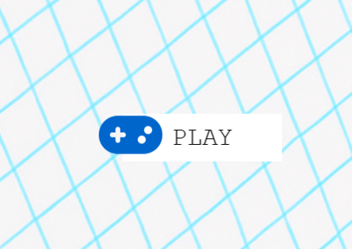
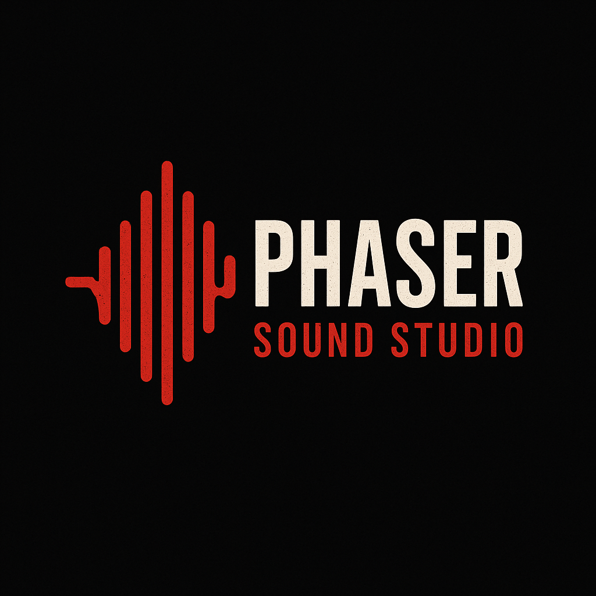

# Phaser Toolkit

A comprehensive collection of tools and utilities for game development with Phaser.

## 📦 Packages

This monorepo contains a cohesive suite of TypeScript-first libraries for Phaser. Each package is focused, well-tested, and built to work great together or stand alone.

<p align="center">
  
</p>

### 🎩 Hudini — Magical UI components for Phaser

<p align="center">
  
</p>

**Hudini** is a collection of reusable, themeable UI components for Phaser games. Named after the famous magician Houdini and HUD (Head-Up Display), it provides a magical toolkit for building consistent game interfaces.

**Key Features:**
- 🎨 **Themeable** - Dark/light themes with full customization
- 📦 **Phaser-wind Dependency** - Only requires phaser-wind
- 🎯 **TypeScript First** - Full type safety and IntelliSense
- 🧪 **Tested** - Comprehensive test coverage

**Components:**
- `Column` - Stacks children vertically with spacing and alignment
- `Row` - Arranges children horizontally with spacing and alignment  
- `IconButton` - Interactive circular icon button with animations
- `FlatIconButton` - Flat-style icon button with customizable colors and opacity

**Links:**
- 📦 [NPM Package](https://www.npmjs.com/package/hudini)
- 📖 [Documentation](packages/hudini/README.md)
- 🎮 [Live Demos](https://renatocassino.github.io/phaser-toolkit/?path=/story/hudini--index)

---

### 🌪️ phaser-wind — Theme system inspired by Tailwind

<p align="center">
  
</p>

**Phaser Wind** brings the joy and simplicity of Tailwind-like design tokens to Phaser games! Stop fighting with magic numbers and random colors.

**Key Features:**
- 🎨 **Complete Tailwind-like Color Palette** - 22 families × 11 shades
- 📐 **Semantic Font Sizes** - From `xs` to `6xl`
- 🧩 **Default constants ready-to-use** - `Color`, `FontSize`, `Spacing`, `Radius`, `Shadow`
- 🧭 **Optional theme system (typed)** - Add your own tokens with strong typing
- 🔧 **TypeScript First** - Full type safety and IntelliSense
- 🎮 **Phaser Ready** - Global plugin for easy access in scenes

**Example:**
```typescript
import { Color, FontSize } from 'phaser-wind';

const button = this.add.text(100, 50, 'Click me!', {
  fontSize: FontSize.css('lg'), // Clear intention!
  fill: Color.rgb('blue-500'), // Beautiful blue
  backgroundColor: Color.rgb('gray-800'), // Perfect contrast
});
```

**Links:**
- 📦 [NPM Package](https://www.npmjs.com/package/phaser-wind)
- 📖 [Documentation](packages/phaser-wind/README.md)
- 🎮 [Live Demos](https://renatocassino.github.io/phaser-toolkit)

---

### 🎨 font-awesome-for-phaser — Font Awesome icons in Phaser

<p align="center">
  
</p>

Use Font Awesome icons as text/sprites directly in your Phaser scenes with zero friction rendering pipeline.

**Key Features:**
- 🎯 **Zero friction rendering** - Direct integration with Phaser text system
- 🎨 **Full control** - Sizing, color and stroke controls
- 📦 **IconText component** - Ready-to-use component for icons
- 🔧 **TypeScript Support** - Full type safety

**Example:**
```typescript
import { IconText } from 'font-awesome-for-phaser';

const icon = new IconText(this, 90, 90, 'gamepad', 64, {
  color: '#0066cc',
  iconStyle: 'solid', // 'solid' | 'regular' | 'brands'
});
```

**Links:**
- 📦 [NPM Package](https://www.npmjs.com/package/font-awesome-for-phaser)
- 📖 [Documentation](packages/font-awesome-for-phaser/README.md)
- 🎮 [Live Demos](https://renatocassino.github.io/phaser-toolkit/?path=/story/font-awesome-for-phaser-icontext--basic)

---

### 🪝 phaser-hooks — React-style hooks for Phaser

<p align="center">
  
</p>

A comprehensive state management library for Phaser games with React-like hooks pattern. Reduce boilerplate and manage state cleanly.

**Key Features:**
- 🎯 **React-like API** - Familiar hooks pattern for Phaser developers
- 🔒 **Type-safe** - Full TypeScript support with compile-time validation
- 🎮 **Phaser-native** - Designed specifically for Phaser lifecycles
- 🧪 **Well-tested** - Comprehensive test coverage
- 🐛 **Debug Mode** - Built-in debug logging for development

**Available Hooks:**
- `withLocalState` - Scene-specific state management
- `withGlobalState` - Application-wide state
- `withPersistentState` - State with localStorage persistence
- `withComputedState` - Derived state that auto-updates
- `withUndoableState` - State with undo/redo functionality
- `withDebouncedState` - State with debounced updates

**Example:**
```typescript
import { withLocalState } from 'phaser-hooks';

const playerState = withLocalState<{ hp: number; level: number }>(
  this,
  'player',
  { hp: 100, level: 1 },
  { debug: true } // Enable debug logging
);

playerState.set({ hp: 90, level: 2 });
const currentPlayer = playerState.get();
```

**Links:**
- 📦 [NPM Package](https://www.npmjs.com/package/phaser-hooks)
- 📖 [Documentation](packages/phaser-hooks/README.md)
- 🎮 [Live Demos](https://renatocassino.github.io/phaser-toolkit/?path=/story/phaser-hooks--index)

---

### 🎵 phaser-sound-studio — Professional audio management

<p align="center">
  
</p>

The ultimate type-safe audio management system for Phaser.js games. Transform your game's audio experience with professional-grade sound management, multi-channel mixing, and automatic volume persistence.

**Key Features:**
- ✅ **Full TypeScript Support** - Complete type safety for sound keys and channels
- 🎛️ **Multi-Channel Audio** - Professional mixing with HUD, SFX, Music, and custom channels
- 💾 **Automatic Persistence** - Player volume preferences saved automatically
- ⚡ **Smart Preloading** - Efficient audio loading with lazy loading fallbacks
- 🎯 **Zero Configuration** - Works out of the box with sensible defaults
- 🔗 **Phaser Hooks Integration** - Leverages battle-tested state management

**Example:**
```typescript
import { getSoundStudio } from 'phaser-sound-studio';

const studio = getSoundStudio<GameSounds, GameChannels>(this);
studio.play('button-click'); // ✅ Type-safe!
studio.setChannelVolume(this, 'music', 0.1); // Lower background music
```

**Links:**
- 📦 [NPM Package](https://www.npmjs.com/package/phaser-sound-studio)
- 📖 [Documentation](packages/phaser-sound-studio/README.md)
- 🎮 [Showcase Games](https://games.cassino.dev)

## 🚀 Getting started

### Prerequisites

- Node.js >= 18.0.0
- pnpm >= 8.0.0

### Instalação

```bash
# Clone o repositório
git clone https://github.com/cassinodev/phaser-toolkit.git
cd phaser-toolkit

# Instale as dependências
pnpm install

# Construa todos os pacotes
pnpm build
```

### Scripts Disponíveis

- `pnpm build` - Builds all packages
- `pnpm test` - Runs tests across all packages
- `pnpm dev` - Starts development mode
- `pnpm lint` - Runs linting across all packages
- `pnpm typecheck` - Checks TypeScript types
- `pnpm clean` - Cleans previous builds
- `pnpm changeset` - Creates a new changeset for versioning
- `pnpm release` - Publishes new versions of packages

## 📋 Project Structure

```
phaser-toolkit/
├── packages/
│   ├── hudini/                    # UI components
│   ├── phaser-wind/              # Design tokens & theming
│   ├── font-awesome-for-phaser/   # Font Awesome icons
│   ├── phaser-hooks/             # State management hooks
│   ├── phaser-sound-studio/      # Audio management
│   └── phaser-toolkit-demo/      # Storybook demos
├── package.json
├── pnpm-workspace.yaml
└── README.md
```

## 🤝 Contribute

Contributions are always welcome! Please read our contribution guide before submitting a PR.

1. Fork the project
2. Create a branch for your feature (`git checkout -b feature/AmazingFeature`)
3. Commit your changes (`git commit -m 'Add some AmazingFeature'`)
4. Push to the branch (`git push origin feature/AmazingFeature`)
5. Open a Pull Request

## 📄 License

This project is licensed under the MIT License - see the [LICENSE](LICENSE) file for details.

## 👨‍💻 Author

**CassinoDev**

- Website: [games.cassino.dev](https://games.cassino.dev)
- GitHub: [@cassinodev](https://github.com/cassinodev)

## ⭐ Show your support

If this project helped you, please give it a ⭐ in the repository!