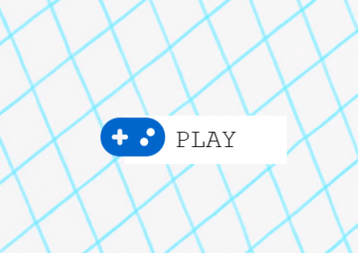
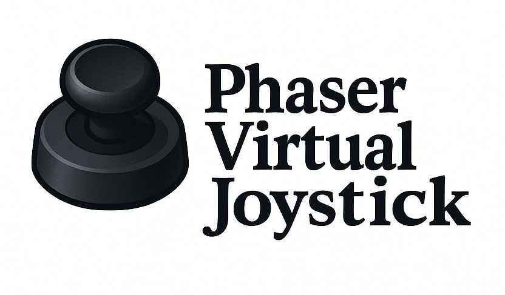
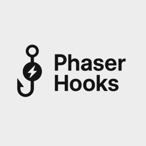
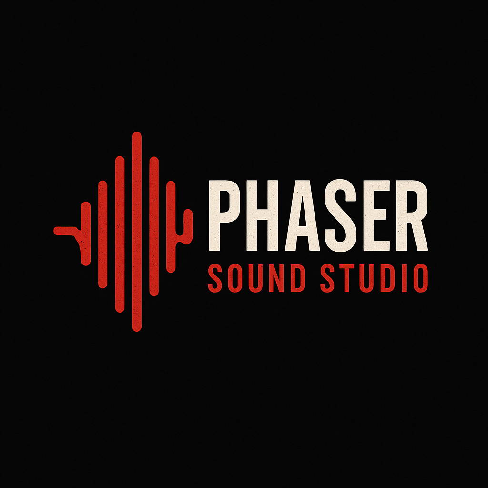
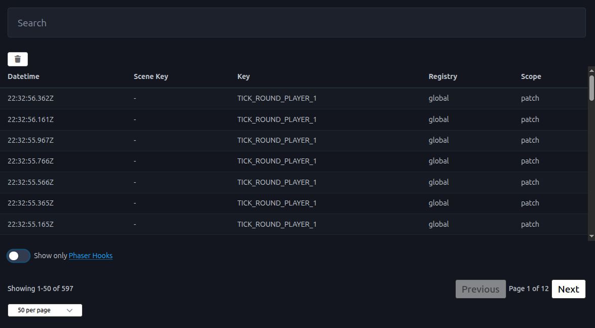

# Phaser Toolkit

A comprehensive collection of tools and utilities for game development with Phaser.

<p align="center">
  
</p>

## 📦 Packages at a glance

A cohesive suite of TypeScript-first libraries for Phaser. Each package is focused, well-tested, and built to work great together or stand alone.

| Package | Purpose | npm |
|---|---|---|
| 🎩 [**Hudini**](#-hudini--magical-ui-components-for-phaser) | UI components (buttons, cards, modals, forms, HUD) | [`hudini`](https://www.npmjs.com/package/hudini) |
| 🌪️ [**phaser-wind**](#%EF%B8%8F-phaser-wind--theme-system-inspired-by-tailwind) | Tailwind-like design tokens (color, spacing, motion, depth…) | [`phaser-wind`](https://www.npmjs.com/package/phaser-wind) |
| 🎨 [**font-awesome-for-phaser**](#-font-awesome-for-phaser--font-awesome-icons-in-phaser) | Render Font Awesome icons directly in Phaser | [`font-awesome-for-phaser`](https://www.npmjs.com/package/font-awesome-for-phaser) |
| 🕹️ [**phaser-virtual-joystick**](#%EF%B8%8F-phaser-virtual-joystick--brawl-stars-style-touch-controls) | Touch joystick for mobile games | [`phaser-virtual-joystick`](https://www.npmjs.com/package/phaser-virtual-joystick) |
| 🪝 [**phaser-hooks**](#-phaser-hooks--react-style-hooks-for-phaser) | React-style state management hooks | [`phaser-hooks`](https://www.npmjs.com/package/phaser-hooks) |
| 🎵 [**phaser-sound-studio**](#-phaser-sound-studio--professional-audio-management) | Type-safe multi-channel audio | [`phaser-sound-studio`](https://www.npmjs.com/package/phaser-sound-studio) |
| 🔍 [**phaser-data-inspector**](#-phaser-data-inspector--devtools-for-phaser-state) | Chrome DevTools extension for game state | [Chrome Web Store](https://chromewebstore.google.com/detail/phaser-data-inspector/jjcogkkooficbbdhfcamcojmepbjnpdk) |

> 🎮 **[Try the live showcase →](https://renatocassino.github.io/phaser-toolkit/)** — interactive demos of every component and feature.

### 🎩 Hudini — Magical UI components for Phaser

<p align="center">
  
</p>

**Hudini** is a collection of reusable, themeable UI components for Phaser games. Named after the famous magician Houdini and HUD (Head-Up Display), it provides a magical toolkit for building consistent game interfaces.

**Key Features:**
- 🎨 **Themeable** - Dark/light themes with full customization via phaser-wind tokens
- 🧱 **Composable** - Preset content + slot overrides (matches daisyUI / Radix mental model)
- 🎯 **TypeScript First** - Full type safety and IntelliSense
- 🧪 **Tested** - Comprehensive test coverage
- 🎬 **Motion-aware** - Consistent animation defaults driven by `Duration` / `Ease` tokens

**Components:**

*Buttons & inputs:* `TextButton`, `IconButton`, `Checkbox`, `Toggle`, `Radio` + `RadioGroup`
*Layout:* `Row`, `Column`, `Stack`, `SizedBox`, `Card`
*Feedback:* `Alert`, `Badge`, `LinearProgress`, `RadialProgress`, `CircularProgress`
*Overlays:* `Modal`, `Overlay`
*Structure:* `Text`, `Dock`

**Links:**
- 📦 [NPM Package](https://www.npmjs.com/package/hudini)
- 📖 [Documentation](packages/hudini/README.md)
- 🎮 [Live Demos](https://renatocassino.github.io/phaser-toolkit/hudini)

---

### 🌪️ phaser-wind — Theme system inspired by Tailwind

<p align="center">
  
</p>

**Phaser Wind** brings the joy and simplicity of Tailwind-like design tokens to Phaser games! Stop fighting with magic numbers and random colors.

**Key Features:**
- 🎨 **Complete Tailwind-like Color Palette** - 22 families × 11 shades
- 📐 **Semantic Font Sizes** - From `xs` to `6xl`
- 🧩 **Full token set** - `Color`, `FontSize`, `Font`, `Spacing`, `Radius`, `Shadow`, `Opacity`, `Duration`, `Ease`, `Depth`, `Pos`
- 📏 **Layout primitives** - `Row` / `Column` for flex-like arrangement with `gap` and `align`
- 🧭 **Optional theme system (typed)** - Add your own tokens with strong typing
- 🔧 **TypeScript First** - Full type safety and IntelliSense
- 🎮 **Phaser Ready** - Global plugin for easy access in scenes

**Example:**
```typescript
import { Color, FontSize, Duration, Ease } from 'phaser-wind';

const button = this.add.text(100, 50, 'Click me!', {
  fontSize: FontSize.css('lg'),          // Clear intention!
  color: Color.rgb('blue-500'),          // Beautiful blue
  backgroundColor: Color.rgb('gray-800'),// Perfect contrast
});

this.tweens.add({
  targets: button,
  scale: 1.1,
  duration: Duration.ms('200'),          // 200ms
  ease: Ease.value('back-out'),          // Cubic-like pop
});
```

**Links:**
- 📦 [NPM Package](https://www.npmjs.com/package/phaser-wind)
- 📖 [Documentation](packages/phaser-wind/README.md)
- 🎮 [Live Demos](https://renatocassino.github.io/phaser-toolkit/phaser-wind)

---

### 🎨 font-awesome-for-phaser — Font Awesome icons in Phaser

<p align="center">
  
</p>

Use Font Awesome icons as text/sprites directly in your Phaser scenes with zero friction rendering pipeline.

**Key Features:**
- 🎯 **Zero friction rendering** - Direct integration with Phaser text system
- 🎨 **Full control** - Sizing, color and stroke controls
- 📦 **IconText component** - Ready-to-use component for icons
- 🔧 **TypeScript Support** - Full type safety

**Example:**
```typescript
import { IconText } from 'font-awesome-for-phaser';

const icon = new IconText(this, 90, 90, 'gamepad', 64, {
  color: '#0066cc',
  iconStyle: 'solid', // 'solid' | 'regular' | 'brands'
});
```

**Links:**
- 📦 [NPM Package](https://www.npmjs.com/package/font-awesome-for-phaser)
- 📖 [Documentation](packages/font-awesome-for-phaser/README.md)
- 🎮 [Live Demos](https://renatocassino.github.io/phaser-toolkit/font-awesome-for-phaser)

---

### 🕹️ phaser-virtual-joystick — Brawl Stars-style touch controls

<p align="center">
  
</p>

A highly customizable, strongly typed virtual joystick for Phaser games — inspired by the smooth follow-behavior of **Brawl Stars**. Great for mobile and touch-based games.

**Key Features:**
- 🎯 **Brawl Stars-inspired follow** - Base drags with the finger for that "on-rails" feel
- 🔧 **Fully customizable** - Colors, sizes, alpha, dead-zone, activation area
- 📱 **Touch-optimized** - Designed for mobile from the ground up
- ⚡ **High performance** - Lightweight, event-driven (`move`, `press`, `release`)
- 🛡️ **Strongly typed** - Complete TypeScript definitions
- 🚫 **UI conflict prevention** - Won't hijack pointer events over buttons

**Example:**
```typescript
import { VirtualJoystick } from 'phaser-virtual-joystick';

const joystick = new VirtualJoystick({
  scene: this,
  baseArea: { radius: 60, fillColor: 0x333333 },
  stick:    { radius: 30, fillColor: 0xffffff },
});
this.add.existing(joystick); // don't forget!
joystick.on('move', ({ x, y }) => player.setVelocity(x * 300, y * 300));
```

**Links:**
- 📦 [NPM Package](https://www.npmjs.com/package/phaser-virtual-joystick)
- 📖 [Documentation](packages/phaser-virtual-joystick/README.md)
- 🎮 [Live Demos](https://renatocassino.github.io/phaser-toolkit/phaser-virtual-joystick)

---

### 🪝 phaser-hooks — React-style hooks for Phaser

<p align="center">
  
</p>

A comprehensive state management library for Phaser games with React-like hooks pattern. Reduce boilerplate and manage state cleanly.

**Key Features:**
- 🎯 **React-like API** - Familiar hooks pattern for Phaser developers
- 🔒 **Type-safe** - Full TypeScript support with compile-time validation
- 🎮 **Phaser-native** - Designed specifically for Phaser lifecycles
- 🧪 **Well-tested** - Comprehensive test coverage
- 🐛 **Debug Mode** - Built-in debug logging for development

**Available Hooks:**
- `withLocalState` - Scene-specific state management
- `withGlobalState` - Application-wide state
- `withPersistentState` - State with localStorage persistence
- `withComputedState` - Derived state that auto-updates
- `withUndoableState` - State with undo/redo functionality
- `withDebouncedState` - State with debounced updates

**Example:**
```typescript
import { withLocalState } from 'phaser-hooks';

const playerState = withLocalState<{ hp: number; level: number }>(
  this,
  'player',
  { hp: 100, level: 1 },
  { debug: true } // Enable debug logging
);

playerState.set({ hp: 90, level: 2 });
const currentPlayer = playerState.get();
```

**Links:**
- 📦 [NPM Package](https://www.npmjs.com/package/phaser-hooks)
- 📖 [Documentation](packages/phaser-hooks/README.md)
- 🎮 [Live Demos](https://renatocassino.github.io/phaser-toolkit/phaser-hooks)

---

### 🎵 phaser-sound-studio — Professional audio management

<p align="center">
  
</p>

The ultimate type-safe audio management system for Phaser.js games. Transform your game's audio experience with professional-grade sound management, multi-channel mixing, and automatic volume persistence.

**Key Features:**
- ✅ **Full TypeScript Support** - Complete type safety for sound keys and channels
- 🎛️ **Multi-Channel Audio** - Professional mixing with HUD, SFX, Music, and custom channels
- 💾 **Automatic Persistence** - Player volume preferences saved automatically
- ⚡ **Smart Preloading** - Efficient audio loading with lazy loading fallbacks
- 🎯 **Zero Configuration** - Works out of the box with sensible defaults
- 🔗 **Phaser Hooks Integration** - Leverages battle-tested state management

**Example:**
```typescript
import { getSoundStudio } from 'phaser-sound-studio';

const studio = getSoundStudio<GameSounds, GameChannels>(this);
studio.play('button-click'); // ✅ Type-safe!
studio.setChannelVolume(this, 'music', 0.1); // Lower background music
```

**Links:**
- 📦 [NPM Package](https://www.npmjs.com/package/phaser-sound-studio)
- 📖 [Documentation](packages/phaser-sound-studio/README.md)
- 🎮 [Live Demos](https://renatocassino.github.io/phaser-toolkit/phaser-sound-studio)
- 🎮 [Showcase Games](https://games.cassino.dev)

---

### 🔍 phaser-data-inspector — DevTools for Phaser state

<p align="center">
  
</p>

A powerful Chrome DevTools extension that brings state inspection capabilities to Phaser game development. Just like Redux DevTools revolutionized React debugging, this extension provides game developers with comprehensive insights into their Phaser game state management.

**Key Features:**
- 🎯 **Real-Time State Monitoring** - Track state changes across Phaser Registry and Scene Data
- 🔍 **Powerful Search & Filter** - Search by state key and filter by source
- 📊 **State Diff Visualization** - Side-by-side comparison with visual diff highlighting
- 📄 **Pagination & Performance** - Handle large event logs efficiently
- 🎮 **Multi-Game Support** - Switch between multiple Phaser game instances
- 🎨 **Modern UI** - Built with React and styled-components

**Example:**
```typescript
import { withLocalState } from 'phaser-hooks';

// In your scene
const { set, get } = withLocalState(this, 'score', 0);

// When score changes, you'll see the diff in the inspector
set(100);
```

**Links:**
- 🛒 [Download Chrome Extension](https://chromewebstore.google.com/detail/phaser-data-inspector/jjcogkkooficbbdhfcamcojmepbjnpdk)
- 📖 [Documentation](packages/phaser-data-inspector/README.md)
- 🔧 [Development Guide](packages/phaser-data-inspector/DEVTOOLS_SETUP.md)

## 🚀 Getting started

Individual packages are installable from npm — pick the ones you need. See the "at a glance" table above for install commands.

To contribute or run the showcase locally, clone the monorepo:

### Prerequisites

- Node.js >= 18.0.0
- pnpm >= 8.0.0

### Installation

```bash
# Clone the repository
git clone https://github.com/renatocassino/phaser-toolkit.git
cd phaser-toolkit

# Install dependencies
pnpm install

# Build every package
pnpm build
```

### Available scripts

- `pnpm build` - Build all packages
- `pnpm test` - Run tests across all packages
- `pnpm dev` - Start development mode (showcase + package watchers)
- `pnpm lint` - Run linting across all packages
- `pnpm typecheck` - Check TypeScript types
- `pnpm clean` - Clean previous builds
- `pnpm changeset` - Create a new changeset for versioning
- `pnpm release` - Publish new versions of packages

## 📋 Project structure

```
phaser-toolkit/
├── packages/
│   ├── hudini/                     # UI components
│   ├── phaser-wind/                # Design tokens & theming
│   ├── font-awesome-for-phaser/    # Font Awesome icons
│   ├── phaser-virtual-joystick/    # Touch joystick
│   ├── phaser-hooks/               # State management hooks
│   ├── phaser-sound-studio/        # Audio management
│   ├── phaser-data-inspector/      # Chrome DevTools extension
│   └── showcase/                   # Astro-powered demo site
├── package.json
├── pnpm-workspace.yaml
└── README.md
```

## 🤝 Contributing

Contributions are always welcome! Please read the [contribution guide](CONTRIBUTING.md) before submitting a PR.

1. Fork the project
2. Create a branch for your feature (`git checkout -b feature/amazing-feature`)
3. Commit your changes (`git commit -m 'feat: add amazing feature'`)
4. Push to the branch (`git push origin feature/amazing-feature`)
5. Open a Pull Request — the [template](.github/pull_request_template.md) will guide you through description, type of change, affected packages, and testing steps.

## 📄 License

This project is licensed under the MIT License - see the [LICENSE](LICENSE) file for details.

## 👨‍💻 Author

**Renato Cassino** ([CassinoDev](https://games.cassino.dev))

- Website: [games.cassino.dev](https://games.cassino.dev)
- GitHub: [@renatocassino](https://github.com/renatocassino)

## ⭐ Show your support

If this project helped you, please give it a ⭐ on the repository!
