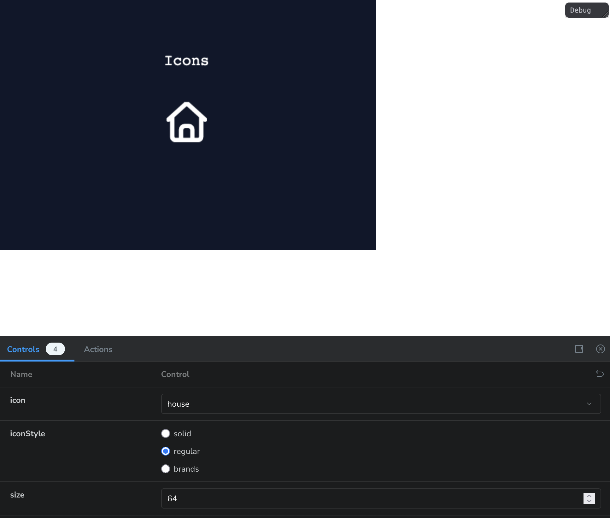

# Font Awesome for Phaser

[](https://www.npmjs.com/package/phaser-wind)
[](https://opensource.org/licenses/MIT)
[](https://www.typescriptlang.org/)

Main utilities and types for game development with Phaser.

## 📦 Instalação

```bash
npm install font-awesome-for-phaser
# or
pnpm add font-awesome-for-phaser
# or
yarn add font-awesome-for-phaser
```

## 🚀 Add to your project

First, you must have the free font awesome imported in your page.

```ts
import { loadFont } from 'font-awesome-for-phaser';
import type Phaser from 'phaser';

const config: Phaser.Types.Core.GameConfig = {
  //......
};

loadFont().then(() => {
  new Game(config);
})

// or
async function startGame() {
  await loadFont();

  new Game(config);
}
```

If you want to use self-hosted fonts, you can pass a URL pointing to your `all.min.css` file:

```ts
loadFont('/fonts/font-awesome/all.min.css').then(() => {
  new Game(config);
})
```

## Usage

You can use Font Awesome icons in your Phaser game in two ways:

### Using icon as text

```typescript
import { getIconChar } from 'font-awesome-for-phaser';

// .....
const iconText = scene.add.text(0, 0, char, {
  font: `36px 'FontAwesome'`, // IMPORTANT! The name of the font MUST BE between char ('), if you use `font: '36px FontAwesome', won't work
  color: '#ffffff',
});
// PS: The font should be 'FontAwesome', or 'Font Awesome 7 Free' or 'Font Awesome 7 Brands'. Depends of the char

iconText.setOrigin(0.5);
scene.add.existing(iconText);

// Or you can use our component
import { IconText } from 'font-awesome-for-phaser';

// PS: `this` is the scene
const icon = new IconText(this, 90, 90, 'gamepad', 64, {
  color: '#0066cc',
  iconStyle: 'solid', // 'solid' | 'regular' | 'brands';
});
this.add.existing(icon); // Don't forget to add in scene
```


You can see more icons in our [storybook](https://renatocassino.github.io/phaser-toolkit/?path=/story/font-awesome-for-phaser-icontext--basic).


