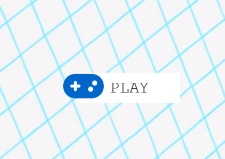

# Font Awesome for Phaser

Utilitários e tipos principais para desenvolvimento de jogos com Phaser.

## 📦 Instalação

```bash
npm install font-awesome-for-phaser
# or
pnpm add font-awesome-for-phaser
# or
yarn add font-awesome-for-phaser
```

## 🚀 Add to your project

First, you must have the free font awesome imported in your page.

```html
<!-- As HTML -->
<link
  rel="preload"
  href="https://cdnjs.cloudflare.com/ajax/libs/font-awesome/7.0.0/webfonts/fa-solid-900.woff2"
  as="font"
  type="font/woff2"
  crossorigin
/>
<link
  rel="preload"
  href="https://cdnjs.cloudflare.com/ajax/libs/font-awesome/7.0.0/webfonts/fa-regular-400.woff2"
  as="font"
  type="font/woff2"
  crossorigin
/>
<link
  rel="preload"
  href="https://cdnjs.cloudflare.com/ajax/libs/font-awesome/7.0.0/webfonts/fa-brands-400.woff2"
  as="font"
  type="font/woff2"
  crossorigin
/>
```

> **Note:** Browsers only load a web font the first time it is requested. This means that, in Phaser, the very first time you display a Font Awesome icon, you may see a missing character (the "tofu" box) instead of the correct icon. After the font is loaded, subsequent icons will display correctly.

To avoid this issue, it is recommended to preload the font files using the `<link rel="preload" ...>` tags shown above **and** to call `loadFont()` before your game starts. This ensures the font is available when Phaser tries to render the icons, preventing the "tofu" character from appearing.

Or, you can use our auto import

```typescript
import { loadFont } from 'font-awesome-for-phaser';

loadFont().then(() => {
  const config: Phaser.Types.Core.GameConfig = {
    // .....
  };
  new Game(config);
});

// or
async function startGame() {
  await loadFont();

  const config: Phaser.Types.Core.GameConfig = {
    // .....
  };
  new Game(config);
}
```

## Usage

You can use Font Awesome icons in your Phaser game in two ways:

### Using icon as text

```typescript
import { getIconChar } from 'font-awesome-for-phaser';

// .....
const iconText = scene.add.text(0, 0, char, {
  font: `36px 'FontAwesome'`, // IMPORTANT! The name of the font MUST BE between char ('), if you use `font: '36px FontAwesome', won't work
  color: '#ffffff',
});
iconText.setOrigin(0.5);
scene.add.existing(iconText);

// Or you can use our component
import { IconText } from 'font-awesome-for-phaser';

// PS: `this` is the scene
const icon = new IconText(this, 90, 90, 'gamepad', 64, {
  color: '#0066cc',
});
this.add.existing(icon); // Don't forget to add in scene
```


