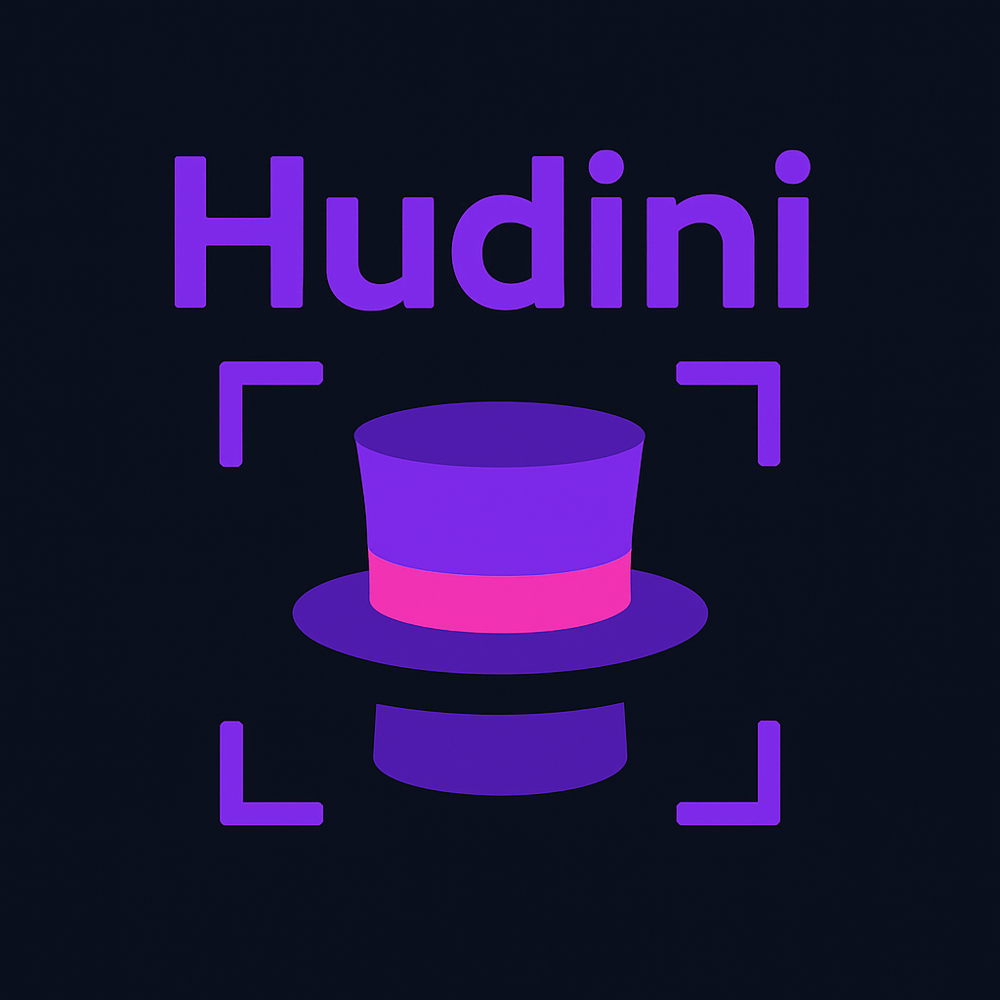

<p align="center">
  
</p>

[](https://www.npmjs.com/package/hudini)
[](https://opensource.org/licenses/MIT)
[](https://www.typescriptlang.org/)


# 🎩 Hudini

> _Magical Phaser UI components that appear when you need them most_

**Hudini** is a collection of reusable, themeable UI components for Phaser games. Named after the famous magician Houdini and HUD (Head-Up Display), it provides a magical toolkit for building consistent game interfaces.

> Important: Hudini is fully type‑safe. The entire library is written in TypeScript and uses strict, explicit types for all public APIs (components, layout options, and plugin configuration). You get compile‑time validation and rich IntelliSense everywhere—no runtime guessing.

## ✨ Features

- 🎨 **Themeable** — dark/light themes with full customization via [phaser-wind](https://github.com/renatocassino/phaser-toolkit/tree/main/packages/phaser-wind) tokens
- 🧱 **Composable** — preset content + slot overrides (matches daisyUI / Radix mental model)
- 🎬 **Motion-aware** — consistent animation defaults driven by `Duration` / `Ease` tokens
- 📦 **Small footprint** — only `phaser-wind` and `font-awesome-for-phaser` as dependencies
- 🎯 **TypeScript first** — full type safety and IntelliSense
- 🧪 **Tested** — comprehensive test coverage

## 🚀 Quick Start

```bash
npm i --save hudini
# or
yarn add hudini
# or
pnpm add hudini
```

## 🌐 UMD/CDN (JavaScript)

If you prefer not to use TypeScript or want to include the library via CDN, use the UMD build:

```html
<script src="https://cdn.jsdelivr.net/npm/hudini@latest/dist/hudini.min.js"></script>
```

The library will be available globally as `window.Hudini`:

```javascript
const theme = window.Hudini.createTheme({
  colors: {
    primary: 'red-300',
    secondary: 'blue-300',
  }
});

const config = {
  plugins: {
    global: [{
      key: window.Hudini.HUDINI_KEY,
      plugin: window.Hudini.HudiniPlugin,
      mapping: window.Hudini.HUDINI_KEY,
      data: { theme }
    }]
  }
};
```

> **⚠️ Note**: While UMD builds are available, we **strongly recommend using TypeScript** for better type safety and IntelliSense.

## 🔌 Installation (Plugin Setup)

Hudini is built on top of `phaser-wind` for theming and UI primitives. The Hudini plugin will automatically install the `phaser-wind` plugin if it isn't already registered.

```ts
import Phaser from 'phaser';
import {
  HudiniPlugin,
  HUDINI_KEY,
  type HudiniPluginData,
  createTheme,
} from 'hudini';

const theme = createTheme({
  colors: {
    primary: 'red-300',
    secondary: 'blue-300',
  },
});

type Theme = typeof theme;

new Phaser.Game({
  type: Phaser.AUTO,
  width: 800,
  height: 600,
  backgroundColor: '#1a1a1a',
  plugins: {
    global: [
      {
        key: HUDINI_KEY,
        plugin: HudiniPlugin,
        mapping: HUDINI_KEY,
        data: { theme } as HudiniPluginData<Theme>,
      },
    ],
  },
});
```

Notes:

- To use the default dark theme, omit `theme` and pass `darkMode: true` in `data`.
- To use the default light theme, import `defaultLightTheme` from `hudini` and pass it as `theme`.

### Requirements

Phaser is a peer dependency:

```bash
pnpm add phaser
```

### Live examples

Explore every component with interactive demos in the [Hudini showcase](https://renatocassino.github.io/phaser-toolkit/hudini).

## 🎯 Accessing the plugin from a scene

Use `withHudini(scene)` to get a fully-typed handle to the plugin. It composes with any base scene, doesn't rely on global module augmentation, and infers your theme's tokens at the call site.

```ts
import Phaser from 'phaser';
import { withHudini } from 'hudini';
import type { ThemeType } from './theme';

class MyScene extends Phaser.Scene {
  create(): void {
    const hudini = withHudini<ThemeType>(this);
    const pw = hudini.pw;

    this.cameras.main.setBackgroundColor(pw.color.rgb('background'));
  }
}
```

Call `withHudini(this)` inside `create()` / `update()` — never in the constructor or `init()`, since the plugin hasn't attached yet.

### Recommended: wrap it in a project-local helper

Passing `<ThemeType>` on every call gets old. Define a one-line helper once:

```ts
// src/theme.ts
import type { Scene } from 'phaser';
import { createTheme, withHudini, type CreateTheme } from 'hudini';

export const theme = createTheme({
  colors: { primary: 'blue-600', danger: 'red-500' },
} satisfies CreateTheme<any>);

export type ThemeType = typeof theme;

/** Project-local accessor — no need to pass the theme type every time. */
export const withHud = (scene: Scene) => withHudini<ThemeType>(scene);
```

Every scene becomes a one-liner:

```ts
class MyScene extends Phaser.Scene {
  create(): void {
    const hudini = withHud(this);
    this.cameras.main.setBackgroundColor(hudini.pw.color.rgb('background'));
  }
}
```

## 🧩 Components

Grouped by intent. Each snippet shows the shape of the API — see the [showcase](https://renatocassino.github.io/phaser-toolkit/hudini) for full interactive demos.

### Layout

#### Row / Column

Flex-like layout primitives. Re-exported from [`phaser-wind`](https://github.com/renatocassino/phaser-toolkit/tree/main/packages/phaser-wind).

```ts
import { Row, Column } from 'hudini';

const row = new Row({
  scene: this, x: 400, y: 80,
  gap: 10,
  align: 'center',              // 'top' | 'center' | 'bottom'
  horizontalOrigin: 'center',   // 'left' | 'center' | 'right'
  children: [heart, gem],
});
row.setGap(16);
row.addChild(star);

const column = new Column({
  scene: this, x: 400, y: 300,
  gap: 12,
  align: 'center',              // 'left' | 'center' | 'right'
  verticalOrigin: 'top',        // 'top' | 'center' | 'bottom'
  children: [spriteA, spriteB],
});
```

Both are `Phaser.GameObjects.Container` subclasses. Common API: `setGap`, `setAlign`, `addChild`, `addChildren`.

#### Stack

Same idea as Row/Column, but with an optional **background card** (padding + `backgroundColor` + `borderRadius`). Great for "grouped controls" panels.

```ts
import { Stack } from 'hudini';

const controls = new Stack({
  scene: this, x: 400, y: 300,
  direction: 'row',             // 'row' | 'column'
  gap: 8,
  align: 'center',
  padding: '4',                 // spacing token or px number
  backgroundColor: 'slate-100',
  borderRadius: 'md',
  children: [playBtn, pauseBtn, stopBtn],
});
```

#### Card

A rounded background that resizes to fit a single child (or an explicit width/height). Use as a base surface — modals, tooltips, and Stack all compose on top of it.

```ts
import { Card } from 'hudini';

const card = new Card({
  scene: this, x: 400, y: 300,
  backgroundColor: 'white',
  borderRadius: 'lg',
  margin: '4',                  // inner padding around the child
  child: contentContainer,
});
```

#### SizedBox

Invisible spacer. Extends `Phaser.GameObjects.Rectangle` for native `setSize` support.

```ts
import { SizedBox } from 'hudini';

new SizedBox({ scene: this, x: 0, y: 0, width: 0, height: 20 });
```

### Buttons & inputs

#### TextButton

Text button with `filled` / `outline` variants and optional left/right icons.

```ts
import { TextButton } from 'hudini';

new TextButton({
  scene: this, x: 400, y: 300,
  text: 'Start game',
  color: 'blue-500',
  variant: 'filled',            // 'filled' | 'outline'
  leftIcon: 'play',             // Font Awesome icon key
  onClick: () => startGame(),
});
```

#### IconButton

Circular icon button with hover/press animations. Same variants as `TextButton`.

```ts
import { IconButton } from 'hudini';

const btn = new IconButton({
  scene: this, x: 100, y: 100,
  icon: 'heart',
  size: 'lg',                   // FontSizeKey or px number
  color: 'red',
  variant: 'filled',
  onClick: () => console.log('like!'),
});

// Advanced event access:
btn.interactive.on('pointerover', () => console.log('hover'));
btn.interactive.once('pointerup', () => console.log('release once'));
```

#### Checkbox

Uncontrolled checkbox with optional label. Uses a Font Awesome icon (default `'check'`) — swap for any icon to theme it per game.

```ts
import { Checkbox } from 'hudini';

new Checkbox({
  scene: this, x: 400, y: 200,
  label: 'Enable sound',
  checked: true,
  color: 'blue-500',
  icon: 'volume-high',
  onChange: (checked, name) => saveSetting('sound', checked),
});
```

#### Toggle

Sliding switch with icon cross-fade. Uncontrolled.

```ts
import { Toggle } from 'hudini';

new Toggle({
  scene: this, x: 400, y: 250,
  label: 'Dark mode',
  checked: false,
  color: 'green-500',           // track when on
  offColor: 'slate-400',        // track when off
  onIcon: 'moon',
  offIcon: 'sun',
  onChange: (checked) => setDarkMode(checked),
});
```

#### Radio + RadioGroup

For a single independent radio use `Radio`. For a mutually-exclusive group use `RadioGroup.createRadio(...)` — the group owns the selected value and disables/enables all radios together.

```ts
import { RadioGroup } from 'hudini';

const group = new RadioGroup({
  scene: this,
  value: 'medium',
  color: 'blue-500',
  onChange: (value) => setDifficulty(value),
});

group.createRadio({ x: 400, y: 200, value: 'easy',   label: 'Easy' });
group.createRadio({ x: 400, y: 240, value: 'medium', label: 'Medium' });
group.createRadio({ x: 400, y: 280, value: 'hard',   label: 'Hard' });
```

### Feedback

#### Alert

Static (or optionally clickable) notification banner with semantic variants (`success`, `error`, `warning`, `info`, `neutral`). Each variant ships with a sensible default color + icon.

```ts
import { Alert } from 'hudini';

new Alert({
  scene: this, x: 400, y: 100,
  variant: 'success',
  text: 'Player saved!',
});

new Alert({
  scene: this, x: 400, y: 160,
  variant: 'warning',
  text: 'Low health',
  leftIcon: 'heart-crack',      // override the variant default
  rightIcon: 'xmark',           // "close" affordance
});
```

#### Badge

A small colored pill for counts, labels, or category tags.

```ts
import { Badge } from 'hudini';

new Badge({
  scene: this, x: 400, y: 300,
  text: 'NEW',
  color: 'blue-600',
  textColor: 'white',
});
```

#### LinearProgress

Horizontal progress bar with an optional indeterminate mode (looping animation).

```ts
import { LinearProgress } from 'hudini';

const bar = new LinearProgress({
  scene: this, x: 400, y: 300,
  width: 500,
  height: 24,
  progress: 0,
  progressColor: 'green-500',
});
bar.setProgress(75);            // animates to 75%
```

#### RadialProgress

Circular arc progress with optional center-text percentage.

```ts
import { RadialProgress } from 'hudini';

const dial = new RadialProgress({
  scene: this, x: 400, y: 300,
  radius: 60,
  thickness: 8,
  progress: 40,
  progressColor: 'blue-500',
  showText: true,
});
dial.setProgress(80);
```

#### CircularProgress

An icon-based spinner. Renders any Font Awesome icon rotating at a configurable RPM — perfect for loading indicators.

```ts
import { CircularProgress } from 'hudini';

const spinner = new CircularProgress({
  scene: this, x: 400, y: 300,
  icon: 'spinner',              // any FA icon key
  size: 'xl',
  color: 'blue',
  rotationsPerMinute: 60,
});
spinner.stop();
spinner.start();
```

### Overlays

#### Modal

Centered dialog composing an `Overlay` + rounded card. Preset content slots (`title`, `description`, `media`, `actions`) cover 95% of dialogs; `header` / `body` / `footer` GameObject slots handle custom composition.

```ts
import { Modal } from 'hudini';

const modal = new Modal({
  scene: this,
  title: 'Delete save?',
  description: 'This cannot be undone.',
  actions: [
    { label: 'Cancel', onClick: () => modal.close() },
    { label: 'Delete', onClick: () => { deleteSave(); modal.close(); } },
  ],
  // convention-over-config defaults — each disablable:
  showCloseButton: true,
  closeOnOverlayClick: true,
  keysToClose: ['ESC'],
  onClose: () => console.log('closed'),
});
modal.open();
```

Customize the X close button:

```ts
new Modal({
  scene: this,
  title: 'Custom X',
  closeButton: {
    icon: 'circle-xmark',
    color: 'red',
    size: 20,
    variant: 'filled',
  },
});
```

#### Overlay

The dim backdrop primitive used by `Modal`. Reusable standalone for loading screens, cutscene dims, tutorial masks.

```ts
import { Overlay } from 'hudini';

const overlay = new Overlay({
  scene: this,
  alpha: 0.8,                   // final dim opacity
  interactive: false,           // don't intercept clicks
});
await overlay.open();           // fades in
// ...load assets...
await overlay.close();
overlay.destroy();
```

### Other

#### Text

Convenience `Phaser.GameObjects.Text` subclass with sensible defaults (Fredoka font, translucent stroke). Pass `strokeThickness: 0` for flat text on light backgrounds.

```ts
import { Text } from 'hudini';

new Text({
  scene: this, x: 400, y: 100,
  text: 'Level 3',
  size: 32,
  color: '#fff',
  strokeThickness: 3,
});
```

#### Dock

daisyUI-style bottom nav bar. Icon + optional label per item, active-item highlight, click callback.

```ts
import { Dock } from 'hudini';

new Dock({
  scene: this, x: 400, y: 560,
  items: [
    { id: 'home',     icon: 'house',   label: 'Home' },
    { id: 'shop',     icon: 'store',   label: 'Shop' },
    { id: 'settings', icon: 'gear',    label: 'Settings' },
  ],
  active: 'home',
  backgroundColor: 'white',
  activeColor: 'blue-500',
  onSelect: (id) => navigateTo(id),
});
```

## 🔗 Live showcase

Every component has an interactive demo with source code in the [Hudini showcase](https://renatocassino.github.io/phaser-toolkit/hudini).
