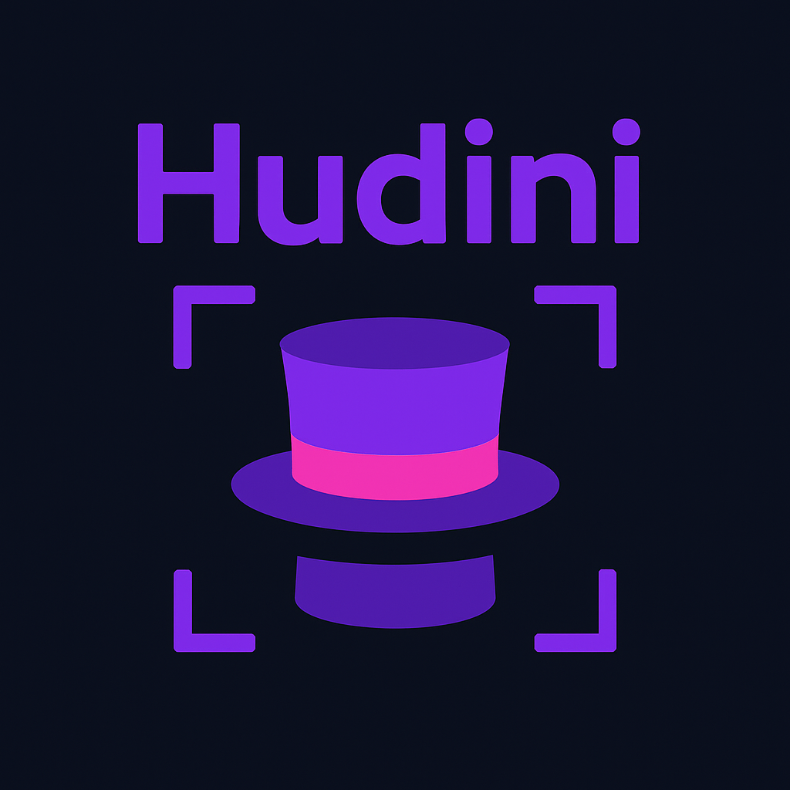

<p align="center">
  
</p>

[](https://www.npmjs.com/package/phaser-wind)
[](https://opensource.org/licenses/MIT)
[](https://www.typescriptlang.org/)


# 🎩 Hudini

> _Magical Phaser UI components that appear when you need them most_

**Hudini** is a collection of reusable, themeable UI components for Phaser games. Named after the famous magician Houdini and HUD (Head-Up Display), it provides a magical toolkit for building consistent game interfaces.

> Important: Hudini is fully type‑safe. The entire library is written in TypeScript and uses strict, explicit types for all public APIs (components, layout options, and plugin configuration). You get compile‑time validation and rich IntelliSense everywhere—no runtime guessing.

## ✨ Features

- 🎨 **Themeable** - Dark/light themes with full customization
- 📦 **Phaser-wind Dependency** - Only requires [Phaser-wind](https://github.com/renatocassino/phaser-toolkit/tree/main/packages/phaser-wind)
- 🎯 **TypeScript First** - Full type safety and IntelliSense
- 🧪 **Tested** - Comprehensive test coverage

## 🚀 Quick Start

```bash
npm i --save hudini
# or
yarn add hudini
# or
pnpm add hudini
```

## 🌐 UMD/CDN (JavaScript)

If you prefer not to use TypeScript or want to include the library via CDN, you can use the UMD build:

```html
<script src="https://cdn.jsdelivr.net/npm/hudini@0.17.0/dist/hudini.min.js"></script>
```

The library will be available globally as `window.Hudini`. You can use it like this:

```javascript
// Create a theme
const theme = window.Hudini.createTheme({
  colors: {
    primary: 'red-300',
    secondary: 'blue-300',
  }
});

// Add Hudini plugin to Phaser config
const config = {
  plugins: {
    global: [{
      key: window.Hudini.HUDINI_KEY,
      plugin: window.Hudini.HudiniPlugin,
      mapping: window.Hudini.HUDINI_KEY,
      data: { theme }
    }]
  }
};
```

> **⚠️ Note**: While UMD builds are available, we **strongly recommend using TypeScript** for better type safety, IntelliSense, and development experience. The TypeScript version provides better error detection and autocomplete features.

## 🔌 Installation (Plugin Setup)

Hudini is built on top of `phaser-wind` for theming and UI primitives. The Hudini plugin will automatically install the `phaser-wind` plugin if it is not already registered. You only need to add Hudini to your Phaser game configuration.

Basic setup with the default light theme:

```ts
import Phaser from 'phaser';
import {
  HudiniPlugin,
  HUDINI_KEY,
  HudiniPluginData,
  createTheme,
} from 'hudini';

const theme = createTheme({
  colors: {
    primary: 'red-300',
    secondary: 'blue-300',
  },
  // This theme is a phaser-wind theme conf. You can read more in https://github.com/renatocassino/phaser-toolkit/tree/main/packages/phaser-wind
});

type Theme = typeof theme;

new Phaser.Game({
  type: Phaser.AUTO,
  width: 800,
  height: 600,
  backgroundColor: '#1a1a1a',
  plugins: {
    global: [
      {
        key: HUDINI_KEY,
        plugin: HudiniPlugin,
        mapping: HUDINI_KEY,
        data: {
          theme,
        } as HudiniPluginData<Theme>,
        /**
         * If you want to use a default theme, you can import "defaultLightTheme" from hudini
         * data: {
         *   theme: defaultLightTheme,
         * } as HudiniPluginData<Theme>
         */
      },
    ],
  },
});
```

Notes:

- Hudini will ensure `phaser-wind` is available internally. If you prefer, you can also register `phaser-wind` explicitly before Hudini and pass a custom theme.
- You can pass `darkMode: true` (when no custom theme is provided) to use the default dark theme.

### Requirements

- Phaser (peer dependency)

```bash
pnpm add phaser
```

### Import

```ts
import { Column, Row, IconButton } from 'hudini';
```

### Live examples

Check the Storybook for live, interactive examples: [Hudini on Storybook](https://renatocassino.github.io/phaser-toolkit/?path=/story/hudini--index)

## 🧩 Components

### Column

Stacks children vertically with spacing, horizontal alignment, and configurable vertical origin.

```ts
// inside a Phaser.Scene (e.g., in create())
const spriteA = this.add.sprite(0, 0, 'player');
const spriteB = this.add.sprite(0, 0, 'enemy');

const column = new Column({
  scene: this,
  x: 400,
  y: 300,
  gap: 12, // default: 8
  align: 'center', // 'left' | 'center' | 'right'
  verticalOrigin: 'top', // 'top' | 'center' | 'bottom'
  children: [spriteA, spriteB],
});

// Update layout options later
column.setGap(20);
column.setAlign('left');

// Add items dynamically
const spriteC = this.add.sprite(0, 0, 'coin');
column.addChild(spriteC); // triggers relayout by default
```

Key points:

- Horizontal alignment aligns each child's left/center/right edge correctly, respecting per-child origin.
- `verticalOrigin` controls where the content starts from within the container.
- The container's position `(x, y)` is the center of the overall content area.

### Row

Arranges children horizontally with spacing, vertical alignment, and configurable horizontal origin.

```ts
// inside a Phaser.Scene (e.g., in create())
const heart = this.add.sprite(0, 0, 'heart');
const gem = this.add.sprite(0, 0, 'gem');

const row = new Row({
  scene: this,
  x: 400,
  y: 80,
  gap: 10, // default: 8
  align: 'center', // 'top' | 'center' | 'bottom'
  horizontalOrigin: 'center', // 'left' | 'center' | 'right'
  children: [heart, gem],
});

row.setGap(16);
row.setAlign('top');

const star = this.add.sprite(0, 0, 'star');
row.addChild(star);
```

Key points:

- Vertical alignment aligns each child's top/center/bottom edge correctly, respecting per-child origin.
- `horizontalOrigin` controls where the content starts from within the container.
- The container's position `(x, y)` is the center of the overall content area.

### IconButton

An interactive circular icon button with hover and click animations, built on top of `phaser-wind` and `font-awesome-for-phaser`.

```ts
import { IconButton } from 'hudini';
// inside a Phaser.Scene (e.g., in create())

const btn = new IconButton({
  scene: this,
  x: 100,
  y: 100,
  icon: 'solid/heart', // any IconKey from font-awesome-for-phaser
  size: 'lg', // FontSizeKey or a number (px)
  color: 'red', // any base color from phaser-wind (except black/white)
  onClick: () => {
    // your click handler
  },
});

this.add.existing(btn);
```

Notes:

- Hover scales the icon subtly, click animates press/release.
- Colors and sizes integrate with `phaser-wind` theme tokens.

### FlatIconButton

A flat-style icon button with customizable colors, opacity, and border radius.

```ts
import { FlatIconButton } from 'hudini';

const flatBtn = new FlatIconButton({
  scene: this,
  x: 200,
  y: 100,
  icon: 'solid/play',
  size: 'lg',
  backgroundColor: 'blue-600',
  iconColor: 'white',
  borderRadius: 'md',
  backgroundOpacity: 0.8,
  iconOpacity: 1,
  onClick: () => {
    // your click handler
  },
});

this.add.existing(flatBtn);
```

### Interactive API

Both `IconButton` and `FlatIconButton` provide direct access to event methods for advanced event handling:

```ts
const button = new IconButton({ 
  scene: this, 
  x: 100, 
  y: 100, 
  icon: 'play',
  onClick: () => console.log('Basic click')
});

// Access interactive methods directly
button.interactive.on('pointerover', () => console.log('Hover'));
button.interactive.on('pointerdown', () => console.log('Press'));
button.interactive.once('pointerup', () => console.log('Release once'));

// Available methods in .interactive:
// - on(event, callback) - Register event listener
// - off(event, callback) - Remove event listener  
// - once(event, callback) - Register one-time event listener
// - setInteractive(options) - Configure interactivity
```
### SizedBox

A simple invisible rectangle component for spacing and layout purposes. It occupies space without any visual appearance.

```ts
import { SizedBox } from 'hudini';
// inside a Phaser.Scene (e.g., in create())

const spacer = new SizedBox({
  scene: this,
  x: 0,
  y: 0,
  width: 0,   // horizontal spacing
  height: 20, // vertical spacing
});

// Use in layouts for precise spacing control
const column = new Column({
  scene: this,
  x: 400,
  y: 300,
  children: [
    new TextButton({ scene: this, x: 0, y: 0, text: 'Button 1' }),
    new SizedBox({ scene: this, x: 0, y: 0, width: 0, height: 20 }),
    new TextButton({ scene: this, x: 0, y: 0, text: 'Button 2' }),
  ]
});
```

Notes:

- Extends `Phaser.GameObjects.Rectangle` for native width/height support.
- Default values: `width: 1px`, `height: 1px` if not specified.
- Perfect for creating custom spacing in layouts where gap isn't sufficient.

## 📦 API Surfaces

- `Column` and `Row` are `Phaser.GameObjects.Container` subclasses. Useful methods:
  - `setGap(gap: number): void`
  - `setAlign(...)`: Column → `'left'|'center'|'right'`, Row → `'top'|'center'|'bottom'`
  - `addChild(child, relayout = true): this`
  - `addChildren(children, relayout = true): this`
- `IconButton` constructor accepts `{ scene, x, y, icon, size?, color?, onClick? }`.
- `SizedBox` extends `Phaser.GameObjects.Rectangle`. Useful methods:
  - `setWidth(width: number): this`
  - `setHeight(height: number): this`
  - `setSize(width: number, height: number): this`

## 🔗 Storybook

Explore all components and props in Storybook: [Hudini on Storybook](https://renatocassino.github.io/phaser-toolkit/?path=/story/hudini--index)
