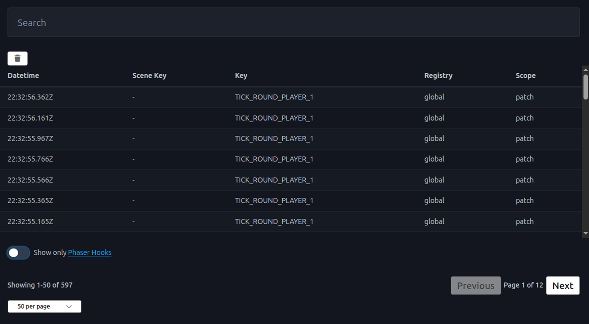
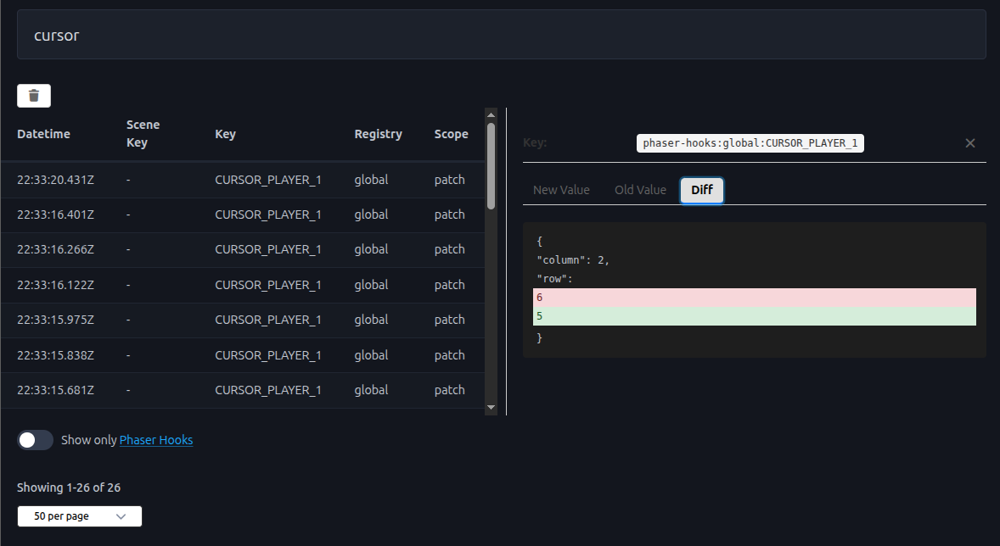

# Phaser Data Inspector 🔍

> The DevTools for Phaser games state - Inspect, debug, and understand your game state in real-time

[](https://chrome.google.com/webstore)
[](https://react.dev/)
[](https://www.typescriptlang.org/)
[](LICENSE)

**Phaser Data Inspector** is a powerful Chrome DevTools extension that brings state inspection capabilities to Phaser game development. Just like Redux DevTools revolutionized React debugging, this extension provides game developers with comprehensive insights into their Phaser game state management.

## ✨ Features

### 🎯 **Real-Time State Monitoring**
- Track state changes across **Phaser Registry** (global) and **Scene Data** (per-scene)
- Monitor state managed by **[phaser-hooks](https://www.npmjs.com/package/phaser-hooks)** library
- View state changes as they happen in your game

### 🔍 **Powerful Search & Filter**
- **Search by state key** - Quickly find specific state variables
- **Filter by source** - Toggle to show only phaser-hooks states
- Real-time filtering as you type

### 📊 **State Diff Visualization**
- **Side-by-side comparison** - View old vs new values
- **Visual diff highlighting** - See exactly what changed
- Syntax-highlighted JSON preview for easy reading
- Available when using phaser-hooks for enhanced debugging

### 📄 **Pagination & Performance**
- Handle large event logs efficiently
- Configurable items per page (10, 50, 100, 1000)
- Smooth navigation through state history

### 🎮 **Multi-Game Support**
- Switch between multiple Phaser game instances
- Separate state tracking per game ID
- Perfect for testing multiple game instances simultaneously

### 🎨 **Modern UI**
- Built with React and styled-components
- Clean, intuitive interface
- Responsive layout with split-pane preview
- Dark theme code highlighting

## 📸 Screenshots

<div align="center">


*State events table with search and filtering*


*Detailed state preview with diff visualization*

</div>

## 🚀 Installation

### Option 1: Load Unpacked Extension (Development)

1. Clone this repository:
```bash
git clone https://github.com/your-org/phaser-toolkit.git
cd phaser-toolkit/packages/phaser-data-inspector
```

2. Install dependencies:
```bash
pnpm install
```

3. Build the extension:
```bash
pnpm build
```

4. Load in Chrome:
   - Open Chrome and navigate to `chrome://extensions/`
   - Enable "Developer mode" (toggle in top right)
   - Click "Load unpacked"
   - Select the `dist` folder from the phaser-data-inspector package

### Option 2: Chrome Web Store (Coming Soon)

The extension will be available on the Chrome Web Store soon. Stay tuned!

## 📖 Usage

### Basic Setup

1. **Install the extension** (see Installation above)

2. **Open Chrome DevTools** on your Phaser game page (F12)

3. **Navigate to the "Phaser" tab** in DevTools

4. **Start your game** - State changes will automatically appear in the inspector

### Using with Phaser Registry

The extension automatically tracks changes to Phaser's global registry:

```javascript
// In your Phaser game
this.registry.set('score', 100);
this.registry.set('lives', 3);
```

### Using with Scene Data

Track per-scene state changes:

```javascript
// In your Phaser scene
this.data.set('playerHealth', 100);
this.data.set('enemyCount', 5);
```

### Using with Phaser Hooks (Recommended)

For the best experience with diff visualization, use **[phaser-hooks](https://www.npmjs.com/package/phaser-hooks)**:

```javascript
import { withLocalState } from 'phaser-hooks';

// In your scene
const { set, get, on } = withLocalState(this, 'score', 0);

// When score changes, you'll see the diff in the inspector
set(100);

get(); // Returns 100

// Reactive events
on('change', (newValue) => {
  this.textScore.setText(newValue);
});
```

### Features Guide

#### 🔍 **Searching States**
- Type in the search box to filter events by state key
- Search is case-insensitive and matches partial keys
- Clear search to show all events

#### 🎯 **Filtering Phaser Hooks**
- Check "Show only Phaser Hooks" to focus on state managed by phaser-hooks
- Useful when debugging complex state management scenarios

#### 📊 **Viewing State Changes**
- Click any event row to view detailed state information
- Switch between tabs:
  - **New Value**: Current state value with syntax highlighting
  - **Old Value**: Previous state value (requires phaser-hooks)
  - **Diff**: Visual comparison showing exactly what changed

#### 📄 **Navigating Events**
- Use pagination controls at the bottom
- Adjust items per page for better performance
- Navigate through pages with Previous/Next buttons

#### 🗑️ **Clearing Events**
- Click the trash icon to clear all captured events
- Useful when starting a new debugging session

## 🛠️ Development

### Prerequisites

- Node.js 18+ 
- pnpm 8+

### Build Commands

```bash
# Development build with watch mode
pnpm dev

# Production build
pnpm build
```

### Project Structure

```
phaser-data-inspector/
├── src/
│   ├── app.tsx                 # Main React application
│   ├── background.ts            # Background service worker
│   ├── content.ts              # Content script
│   ├── injected-script.ts     # Script injected into page
│   ├── devtools.ts             # DevTools panel setup
│   ├── components/             # React components
│   │   ├── events-table.tsx
│   │   ├── preview-state-event.tsx
│   │   └── pagination-controls.tsx
│   └── store/                  # State management (Zustand)
│       ├── use-events.ts
│       ├── use-filters.ts
│       └── use-filtered-events.ts
├── public/                     # Static assets
├── dist/                       # Build output
└── data/                       # Preview images
```

### Architecture

The extension uses a multi-context architecture:

- **Content Script** (`content.ts`): Injected into game pages to detect Phaser instances
- **Background Service Worker** (`background.ts`): Routes messages between contexts
- **Injected Script** (`injected-script.ts`): Runs in page context to intercept Phaser state changes
- **DevTools Panel** (`app.tsx`): React UI displayed in Chrome DevTools

## 🤝 Contributing

Contributions are welcome! Please read our [Contributing Guide](../../CONTRIBUTING.md) for details on our code of conduct and the process for submitting pull requests.

### Development Setup

1. Fork the repository
2. Create your feature branch (`git checkout -b feature/amazing-feature`)
3. Make your changes
4. Build and test locally
5. Commit your changes (`git commit -m 'Add some amazing feature'`)
6. Push to the branch (`git push origin feature/amazing-feature`)
7. Open a Pull Request

## 📝 License

This project is licensed under the MIT License - see the [LICENSE](../../LICENSE) file for details.

## 🙏 Acknowledgments

- Inspired by [Redux DevTools](https://github.com/reduxjs/redux-devtools)
- Built with [Phaser](https://phaser.io/)
- Compatible with [phaser-hooks](https://www.npmjs.com/package/phaser-hooks)

## 📚 Related Projects

- [phaser-hooks](https://www.npmjs.com/package/phaser-hooks) - State management library for Phaser
- [Phaser](https://phaser.io/) - The fast, fun, and free open source HTML5 game framework

## 💬 Support

Found a bug or have a feature request? Please [open an issue](https://github.com/your-org/phaser-toolkit/issues).

---

<div align="center">
  Made with ❤️ for the Phaser community
</div>
