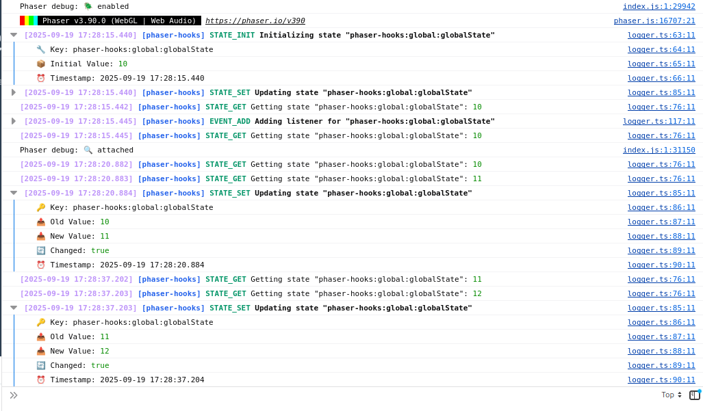

<p align="center" style="margin: 0 auto;">
  
</p>

[](https://www.npmjs.com/package/phaser-wind)
[](https://opensource.org/licenses/MIT)
[](https://www.typescriptlang.org/)

# Phaser Hooks

React-like state management for Phaser 3 games. Simple, type-safe, and powerful.

## Why phaser-hooks?

Phaser gives you `registry` (global) and `data` (local) for state management. They work, but the API is verbose and error-prone:

```ts
// Phaser's built-in way - this == scene
this.game.registry.set('volume', 0.5);
const volume = this.game.registry.get('volume');

this.game.registry.events.on('changedata-volume', (game, value) => {
  console.log('Volume changed to', value);
});

this.data.set('score', 42);
const score = this.data.get('score');

this.onChangeFn = (scene, value) => {
  console.log('Score updated to', value);
};
this.data.events.on('changedata-score', this.onChangeFn); // If you pass an anonymous function, you cannot unsubscribe

// when move to another scene, you must unsubscribe. Boring and easy to forget
this.data.events.off('changedata-score', this.onChangeFn);
```

**With _phaser-hooks_, you get a simple, React-like API:**

```ts
const volume = withGlobalState(this, 'volume', 0.5);
volume.get(); // Returns: 0.5
volume.set(0.8); // updates value

this.unsubscribe = volume.on('change', () => {
  console.log('Volume changed →', volume.get())
}); // Returns the easy unsubscribe function

// When changing scenes
this.unsubscribe();
```

### Key Benefits

- ✅ **React-like patterns** - Hooks work just like React: same key = same state
- ✅ **Type-safe** - Full TypeScript support with inference
- ✅ **Memory safe** - Auto-cleanup prevents memory leaks
- ✅ **Feature-rich** - Persistence, computed state, undo/redo, validation
- ✅ **Familiar** - React-like patterns for easier onboarding


## Installation

```bash
npm install phaser-hooks
# or
pnpm add phaser-hooks
# or
yarn add phaser-hooks
```

> **Note:** This library uses "with" prefix (e.g., `withLocalState`) instead of "use" to avoid ESLint warnings in `.ts` files.

## Quick Start

Here's a complete example showing the basics:

```typescript
import { withLocalState, withGlobalState } from 'phaser-hooks';
// or const { withLocalState, withGlobalState } = require('phaser-hooks');

class GameScene extends Phaser.Scene {
  private unsubscribe?: () => void;

  create() {
    // 1. Local state (scene-specific, auto-cleanup)
    const player = withLocalState(this, 'player', { 
      hp: 100, 
      maxHp: 100,
      level: 1 
    });

    // 2. Global state (persists across scenes)
    const settings = withGlobalState(this, 'settings', { 
      volume: 0.8,
      difficulty: 'normal' 
    });

    // 3. Update state
    player.patch({ hp: 90 }); // Partial update
    settings.set({ volume: 0.5, difficulty: 'hard' }); // Full update

    // 4. Read state
    console.log(player.get().hp); // 90
    console.log(settings.get().volume); // 0.5

    // 5. Listen to changes
    this.unsubscribe = player.on('change', (newPlayer, _oldPlayer) => {
      if (newPlayer.hp < 20) {
        console.warn('Low health!');
      }
    });
  }

  shutdown() {
    // 6. Clean up (local state auto-cleans, but good practice)
    this.unsubscribe?.();
  }
}
```

**That's it!** You now have reactive, type-safe state management in your Phaser game.

### Recommended: Create Custom Hooks

**Just like React**, the real power comes from creating reusable hooks:
```typescript
// hooks/withPlayerState.ts
import { withLocalState } from 'phaser-hooks';

export function withPlayerState(scene: Phaser.Scene) {
  return withLocalState(scene, 'player', {
    hp: 100,
    maxHp: 100,
    level: 1,
    exp: 0
  });
}

// GameScene.ts
import { withPlayerState } from './hooks/withPlayerState';

class GameScene extends Phaser.Scene {
  create() {
    const player = withPlayerState(this); // Clean and reusable!
    player.patch({ hp: 90 });
  }
}

// HealthBar.ts - Access the SAME state!
class HealthBar extends Phaser.GameObjects.Container {
  constructor(scene: Phaser.Scene) {
    super(scene, 0, 0);
    
    const player = withPlayerState(scene); // Same state instance!
    
    player.on('change', (newPlayer) => {
      this.updateDisplay(newPlayer.hp, newPlayer.maxHp);
    });
  }
}
```

**Key insight:** Using the same `key` returns the same state instance, just like React hooks! This allows you to access state from anywhere: scenes, components, systems, etc.

### Advanced: Hooks with Custom Methods
```typescript
// hooks/withPlayerState.ts
export function withPlayerState(scene: Phaser.Scene) {
  const state = withLocalState(scene, 'player', {
    hp: 100,
    maxHp: 100,
    level: 1
  });

  return {
    ...state,
    
    // Add domain-specific methods
    takeDamage: (amount: number) => {
      const current = state.get();
      state.patch({ hp: Math.max(0, current.hp - amount) });
    },
    
    heal: (amount: number) => {
      const current = state.get();
      state.patch({ hp: Math.min(current.maxHp, current.hp + amount) });
    },
    
    levelUp: () => {
      const current = state.get();
      state.patch({ 
        level: current.level + 1,
        maxHp: current.maxHp + 10,
        hp: current.maxHp + 10
      });
    }
  };
}

// Usage
const player = withPlayerState(this);
player.takeDamage(30); // Clean, expressive API!
player.heal(10);
player.levelUp();
```

### Next Steps

- 📚 [Full documentation and examples](https://toolkit.cassino.dev/phaser-hooks)
- 🎣 [See all available hooks](#features)
- 🔧 [API reference](#hook-api-reference)

## Hook API Reference

All hooks return a `HookState<T>` object with the following methods:

| Method | Description | Parameters | Returns |
|--------|-------------|------------|---------|
| `get()` | Gets the current state value | None | `T` - Current state value |
| `set(value)` | Sets a new state value and triggers change listeners | `value: T \| ((current: T) => T)` | `void` |
| `patch(value)` | Patches object state with partial updates (deep merge) | `value: Partial<T> \| ((current: T) => Partial<T>)` | `void` |
| `on('change', callback)` | Registers a callback for state changes | `callback: (newValue: T, oldValue: T) => void` | `() => void` - Unsubscribe function |
| `once('change', callback)` | Registers a callback that fires only once | `callback: (newValue: T, oldValue: T) => void` | `() => void` - Unsubscribe function |
| `off('change', callback)` | Removes a specific event listener | `callback: (newValue: T, oldValue: T) => void` | `void` |
| `clearListeners()` | Removes all event listeners for this state | None | `void` |

### Notes

- **`set()`** accepts either a value or an updater function for safe updates
- **`patch()`** only works with object states and performs deep merging
- **`on()`/`once()`/`off()`** only support the `'change'` event
- **`off()`** requires the exact same function reference passed to `on()`

## Core Concepts

### Updater Functions

Both `set()` and `patch()` accept updater functions for race-condition-safe updates:
```typescript
// Direct value
player.set({ hp: 90, level: 2 });

// Updater function (recommended when based on current state)
player.set(current => ({ ...current, hp: current.hp - 10 }));

// Patch with updater
player.patch(current => ({ hp: current.hp + 20 }));
```

**Why use updater functions?** They always work with the latest state, preventing race conditions in async scenarios.

---

### `set()` vs `patch()`

- **`set()`** - Full state replacement
- **`patch()`** - Partial update with deep merge (only for objects)
```typescript
const player = withLocalState(this, 'player', { 
  hp: 100, 
  maxHp: 100, 
  level: 1 
});

player.set({ hp: 90, maxHp: 100, level: 1 }); // Must provide all properties
player.patch({ hp: 90 }); // Only updates hp, preserves maxHp and level
```

**Rule of thumb:** Use `patch()` for object states when you only need to update specific properties.

### Composing Hooks

You can compose your own hooks using other with\* hooks — similar to how custom React hooks are built. This is a powerful way to isolate logic, reuse behavior, and keep your scenes clean and focused.

Example: Extracting a withPlayerEnergy hook from withPlayerState

Imagine you have a local player state like this:

```ts
interface PlayerAttributes {
  energy: number;
  stamina: number;
  strength: number;
  agility: number;
}

const playerState = withLocalState<PlayerAttributes>(scene, 'player', {
  energy: 100,
  stamina: 80,
  strength: 50,
  agility: 40,
});
```

You can now create a custom hook focused only on energy:

```ts
function withPlayerEnergy(scene: Phaser.Scene) {
  const player = withLocalState<PlayerAttributes>(scene, 'player', {
    energy: 100,
    stamina: 80,
    strength: 50,
    agility: 40,
  });

  return {
    ...player,
  };
}
```

Usage in a scene

```ts
const energy = withPlayerEnergy(this);

console.log('Current energy:', energy.get());

// Using updater function (recommended)
energy.set((currentEnergy) => currentEnergy - 10);

// Alternative: direct value
// energy.set(energy.get() - 10);

energy.on('change', () => {
  if (energy.get() <= 0) {
    console.warn('You are out of energy!');
  }
});
```

## Debug Mode / Dev tool

Phaser Hooks includes a built-in debug mode that provides detailed logging for state operations. This is extremely useful for development and troubleshooting state management issues.

### How to Enable Debug Mode

To enable debug mode, simply pass `{ debug: true }` in the options parameter when creating any hook:

```typescript
import { withLocalState } from 'phaser-hooks';

export class GameScene extends Phaser.Scene {
  create() {
    // Enable debug mode for this state
    const playerState = withLocalState<{ hp: number; level: number }>(
      this,
      'player',
      {
        hp: 100,
        level: 1,
      },
      { debug: true } // Enable debug logging
    );

    // All operations will now be logged to the console
    playerState.set({ hp: 90, level: 2 });
    const currentPlayer = playerState.get();

    // Listen to changes with debug info
    playerState.on('change', (newPlayer, oldPlayer) => {
      console.log('Player state changed:', newPlayer);
    });
  }
}
```


*Screenshot showing debug logs in browser console*

### Debug Log Format

Debug logs follow a consistent format with timestamps and structured information:

```
[phaser-hooks] 2024-01-15 10:30:45 [INIT] player - Initializing state with value: {hp: 100, level: 1}
[phaser-hooks] 2024-01-15 10:30:46 [SET] player - Updating state: {hp: 90, level: 2} (was: {hp: 100, level: 1})
[phaser-hooks] 2024-01-15 10:30:47 [GET] player - Retrieved state: {hp: 90, level: 2}
[phaser-hooks] 2024-01-15 10:30:48 [EVENT] player - Added change listener
```

### Best Practices for Debug Mode

- **Development Only**: Only enable debug mode during development. Remove `{ debug: true }` in production builds
- **Selective Debugging**: Enable debug mode only for the specific states you're troubleshooting
- **Performance**: Debug mode adds overhead, so avoid enabling it for all states in production
- **Console Filtering**: Use browser console filters to focus on specific log types

### Example: Debugging State Issues

```typescript
export class DebugScene extends Phaser.Scene {
  create() {
    // Enable debug for problematic state
    const inventoryState = withLocalState<string[]>(
      this,
      'inventory',
      [],
      { debug: true }
    );

    // Debug logs will show exactly what's happening
    inventoryState.set(['sword', 'potion']);
    inventoryState.set([...inventoryState.get(), 'shield']);
    
    // Check console for detailed operation logs
  }
}
```

## License

MIT
