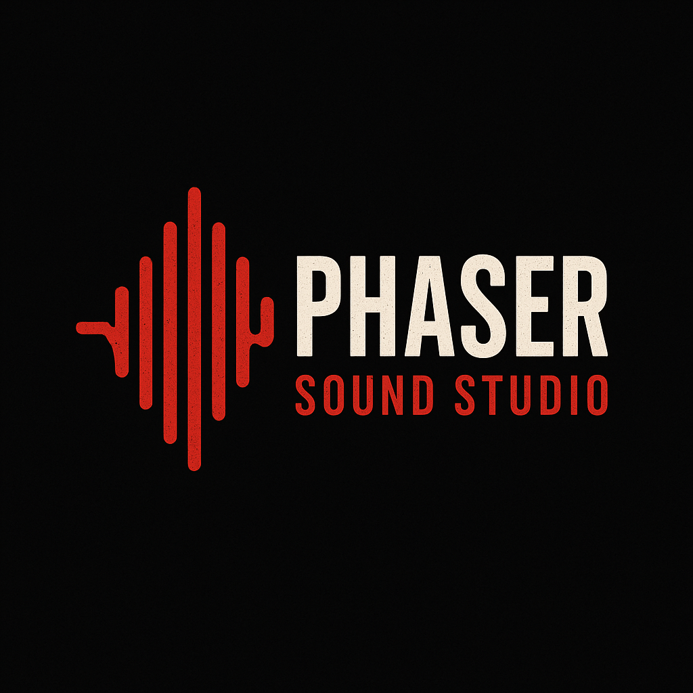

<p align="center">
    
</p>


[](https://www.npmjs.com/package/phaser-wind)
[](https://opensource.org/licenses/MIT)
[](https://www.typescriptlang.org/)

# 🎵 Phaser Sound Studio

The ultimate type-safe audio management system for Phaser.js games

Transform your game's audio experience with professional-grade sound management, multi-channel mixing, and automatic volume persistence - all with full TypeScript support.

# 🚀 Why Phaser Sound Studio?

The Problem
Managing audio in Phaser games is often chaotic:

- ❌ No type safety for sound keys
- ❌ Manual volume management across different audio categories
- ❌ Complex preloading logic
- ❌ No automatic settings persistence
- ❌ Scattered audio code throughout your scenes

## The Solution

Phaser Sound Studio provides a centralized, type-safe audio management system that handles everything:

- ✅ Full TypeScript Support - Complete type safety for sound keys and channels

- ✅ Multi-Channel Audio - Professional mixing with HUD, SFX, Music, and custom channels
- ✅ Automatic Persistence - Player volume preferences saved automatically
- ✅ Smart Preloading - Efficient audio loading with lazy loading fallbacks
- ✅ Zero Configuration - Works out of the box with sensible defaults
- ✅ Phaser Hooks Integration - Leverages battle-tested state management
- ✅ Effortless control over how many sounds can play simultaneously per channel
- ✅ Automatic audio pooling to reuse sound instances and avoid unnecessary recreation
- ✅ Guarantees background music plays only once (no overlapping)
- ✅ Sound effects have configurable limits to prevent audio overload

## 📦 Installation

```bash
npm install phaser-sound-studio
# or
yarn add phaser-sound-studio
# or
pnpm add phaser-sound-studio
```

## 🌐 UMD/CDN (JavaScript)

If you prefer not to use TypeScript or want to include the library via CDN, you can use the UMD build:

```html
<script src="https://cdn.jsdelivr.net/npm/phaser-sound-studio@0.5.0/dist/phaser-sound-studio.min.js"></script>
```

The library will be available globally as `window.PhaserSoundStudio`. You can use it like this:

```javascript
// Get sound studio instance
const soundStudio = window.PhaserSoundStudio.getSoundStudio(scene);

// Play a sound
soundStudio.play('ui-click', 'ui');

// Set channel volume
soundStudio.setChannelVolume('music', 0.5);
```

> **⚠️ Note**: While UMD builds are available, we **strongly recommend using TypeScript** for better type safety, IntelliSense, and development experience. The TypeScript version provides better error detection and autocomplete features.

## 🔥 Quick Start

1. Define Your Audio Configuration

```ts
// src/config/audio.config.ts
import { getSoundStudio } from 'phaser-sound-studio';

// Define your sound channels (fully type-safe)
const CHANNELS = {
  HUD: 'hud',
  MUSIC: 'music',
  SFX: 'sfx',
  VOICE: 'voice',
} as const;

// Define your sound keys (fully type-safe)
const SOUNDS = {
  BUTTON_HOVER: 'button-hover',
  BUTTON_CLICK: 'button-click',
  BACKGROUND_MUSIC: 'bg-music',
  PLAYER_JUMP: 'jump-sfx',
} as const;

// Important types setted here
type GameChannels = (typeof CHANNELS)[keyof typeof CHANNELS];
type GameSounds = (typeof SOUNDS)[keyof typeof SOUNDS];

// Your audio configuration
const audioConfig = {
  soundList: {
    'button-hover': {
      channel: 'hud', // if pass an invalid value, should have type error
      loop: false, // default is false
      preload: true, // default is true
      path: '/audio/ui/hover.mp3',
    },
    'button-click': {
      channel: 'hud',
      loop: false,
      path: '/audio/ui/click.wav',
    },
    'bg-music': {
      channel: 'music',
      loop: true,
      path: '/audio/music/theme.ogg',
    },
    'jump-sfx': {
      channel: 'sfx',
      loop: false,
      preload: false, // If you don't want load in preloader
      path: '/audio/sfx/jump.m4a',
    },
  } satisfies SoundListConfig<GameSounds, GameChannels>,
  channels: {
    [CHANNELS.HUD]: {
      // HUD channel: for UI sounds, allow multiple instances
      mode: 'multiple', // allow multiple sounds at once
      maxInstances: 3, // up to 3 sounds can play simultaneously
    },
    [CHANNELS.MUSIC]: {
      // MUSIC channel: for background music, only one at a time
      mode: 'single', // only one music track at a time
    },
    [CHANNELS.SFX]: {
      // SFX channel: for sound effects, allow multiple
      mode: 'multiple', // allow overlapping sound effects
      maxInstances: 5, // up to 5 SFX can play at once
    },
    [CHANNELS.VOICE]: {
      // VOICE channel: for voice lines, only one at a time
      mode: 'single', // only one voice line at a time
    },
  },
  storage: 'local' as const, // or 'session'
  gameName: 'my-awesome-game', // Optional: for unique storage keys
};
```

## 2. Register the Plugin

```ts
// In your Phaser game config
import {
  PhaserSoundStudioPlugin,
  PHASER_SOUND_STUDIO_KEY,
} from 'phaser-sound-studio';

const config: Phaser.Types.Core.GameConfig = {
  // ... your game config
  plugins: {
    global: [
      {
        key: PHASER_SOUND_STUDIO_KEY,
        plugin: PhaserSoundStudioPlugin,
        start: true,
        data: audioConfig,
      },
    ],
  },
};

new Phaser.Game(config);
```

## 3. Use in Your Scenes

To use in your scenes there is some ways.

### Function getSoundStudio

```ts
import {
  SOUNDS,
  CHANNELS,
  type GameSounds,
  type GameChannels,
} from 'config/audio.config';

export class GameScene extends Phaser.Scene {
  preload() {
    const studio = getSoundStudio(this);
    studio.loadAll(this); // preload all audios with preload different of false
  }

  create() {
    // Get the sound studio with full type safety 💪
    const studio = getSoundStudio<GameSounds, GameChannels>(this); // Strong type check 💪

    // studio.loadByChannel(this, 'hud'); // Load specific channel

    // Set up UI with perfect type safety
    const button = this.add.text(400, 300, 'Click Me!', { fontSize: '32px' });
    button
      .setInteractive()
      .on('pointerover', () => {
        studio.play(SOUNDS.BUTTON_HOVER); // ✅ Type-safe!
        // example of error
        // studio.play(this, 'my-custom-button-hover'); // ❌ Type check error!!!
      })
      .on('pointerdown', () => {
        studio.play('button-click'); // ✅ Type-safe!
      });

    // Professional audio mixing
    studio.setChannelVolume(this, 'music', 0.1); // Lower background music
    studio.muteChannel(this, 'voice'); // Mute voice channel

    // Play background music
    studio.play(CHANNELS.BG_MUSIC); // ✅ Type-safe!
    // Example of error. If you call
    // studio.play('invalid-key'); // ❌ Type check error!!!
  }

  update() {
    const studio = getSoundStudio<GameSounds, GameChannels>(this);

    // Lazy loading - sound will be loaded if not cached
    if (this.cursors.space.isDown) {
      studio?.play(SOUNDS.PLAYER_JUMP); // Auto-loads if needed!
    }
  }
}
```

## 🎛️ Channel Management

Control your game's audio mix like a pro:

```ts
const studio = getSoundStudio<GameSounds, GameChannels>(this);

// Volume control (0.0 to 1.0)
studio.setChannelVolume(this, 'music', 0.2); // Quiet background music
studio.setChannelVolume(this, 'sfx', 0.8); // Louder sound effects
studio.setChannelVolume(this, 'hud', 1.0); // Full volume UI sounds

// Mute/Unmute entire channels
studio.muteChannel(this, 'music'); // Silence music
studio.unmuteChannel(this, 'music'); // Restore music

// Get current settings
const musicVolume = studio.getChannelVolume('music');
const allChannels = studio.getAllChannels();

// All volume changes are automatically saved to localStorage/sessionStorage!
```

## 🎯 Advanced Usage

#### Settings Menu Integration

```ts
export class SettingsScene extends Phaser.Scene {
  create() {
    const studio = getSoundStudio<GameSounds, GameChannels>(this);
    if (!studio) return;

    // Create volume sliders for each channel
    studio.getAllChannels().forEach((channel, index) => {
      const currentVolume = studio.getChannelVolume(channel);

      // Your UI slider component
      const slider = this.createVolumeSlider(
        100,
        100 + index * 60,
        channel,
        currentVolume,
        newVolume => studio.setChannelVolume(this, channel, newVolume)
      );
    });
  }
}
```

#### Dynamic Audio Loading

```ts
// Load specific sounds on demand
studio.loadBySoundKey(this, 'rare-powerup-sound');

// Check if sound is loaded
if (studio.isSoundLoaded(this, 'boss-music')) {
  studio.play(this, 'boss-music');
} else {
  // Will auto-load and play
  studio.play(this, 'boss-music');
}

// Play sound only if not already playing
studio.playOnce(this, 'ambient-loop');
```

## 🔧 Alternative Setup Methods

### Option 1: Helper Function (Easiest and Recommended)

```ts
// Clean, functional approach with full type safety
const studio = getSoundStudio<GameSounds, GameChannels>(this);
studio?.play(this, 'button-click');
```

### Option 2: Direct Scene Access

```ts
// For those who prefer this.studio syntax
declare module 'phaser' {
  namespace Phaser {
    interface Scene {
      soundStudio?: PhaserSoundStudioPlugin<GameSounds, GameChannels>;
    }
  }
}

// Now you can use this.studio directly
export class GameScene extends Phaser.Scene {
  create() {
    this.studio?.play(this, 'button-hover'); // ✅ Fully typed!
  }
}

// Note: If you have more than one game in the same repository, there may be conflicts.
```

## 🏗️ Configuration Options

```ts
type PhaserSoundStudioPluginData = {
  soundList: SoundListConfig<TSoundKey, TChannel>; // Your audio definitions
  channels: TChannel[]; // Available audio channels
  storage: 'local' | 'session'; // Persistence storage type
  gameName?: string; // Optional: unique storage namespace
};

type SoundConfig = {
  channel: TChannel; // Which channel this sound belongs to
  volume: number; // Base volume (0.0 to 1.0)
  loop: boolean; // Should this sound loop?
  preload: boolean; // Load during scene preload phase?
  path: string; // Path to audio file
};
```

# 🤝 Integration with Phaser Hooks

Phaser Sound Studio leverages [phaser-hooks](https://github.com/renatocassino/phaser-toolkit/tree/main/packages/phaser-hooks) for state management:

```ts
import { withPersistentState } from 'phaser-hooks';

// Volume settings are automatically persisted using phaser-hooks
// No additional setup required - it just works!
```

This ensures:

- ✅ Reliable state persistence across browser sessions
- ✅ Consistent storage API (localStorage/sessionStorage)
- ✅ Battle-tested state management
- ✅ Seamless integration with other phaser-hooks features

## 📄 License

MIT License - feel free to use in commercial projects!

## 🛠️ Contributing

Found a bug? Have a feature request? We'd love your contributions!

1. Fork the repository
2. Create your feature branch
3. Add tests for new functionality
4. Submit a pull request

## ⭐ Support

If Phaser Sound Studio saved you development time, please give it a star! ⭐

Your support helps maintain and improve this project for the entire Phaser.js community.

---

Made with ❤️ for the Phaser.js community

## Showcase

🎮 If you have a game using Phaser Sound Studio, open an issue and we'll add it to this list!

- [Matrix Game Typer](https://games.cassino.dev/game/matrix-typer/)
  - Typing training game
- [Smart Dots Reloaded](https://games.cassino.dev/game/smart-dots-reloaded/)
  - Remake of the Smart Dots game from Windows 3.1
- [Elemental Clash](https://games.cassino.dev/game/elemental-clash/)
  - Jackpot game with elementals
