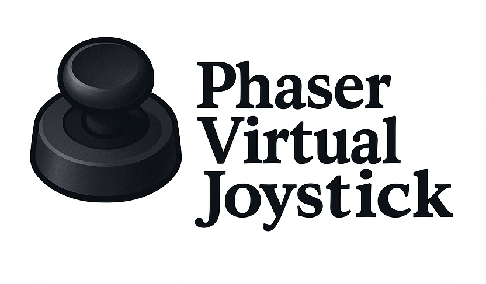
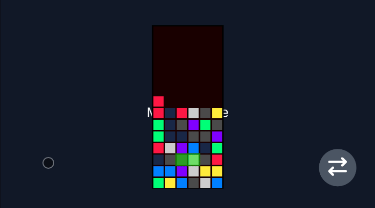
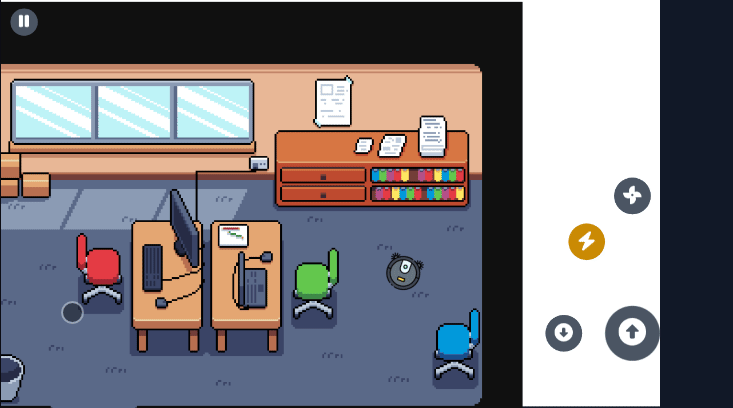

# 🎮 Phaser Virtual Joystick



[](https://badge.fury.io/js/phaser-virtual-joystick)
[](https://www.typescriptlang.org/)
[](https://opensource.org/licenses/MIT)

A **highly customizable** and **strongly typed** virtual joystick component for Phaser.js games, inspired by the smooth and intuitive controls from **Brawl Stars**. Perfect for mobile games and touch-based interactions.

## ✨ Features

- 🎯 **Brawl Stars-inspired behavior** - Smooth joystick following and intuitive touch controls
- 🔧 **Fully customizable** - Colors, sizes, transparency, and visual styling
- 📱 **Touch-optimized** - Designed specifically for mobile and touch devices
- 🎮 **Smart bounds detection** - Configurable activation areas
- ⚡ **High performance** - Lightweight and optimized for games
- 🛡️ **Strongly typed** - Full TypeScript support with comprehensive type definitions
- 🎨 **Visual feedback** - Dead zone, base area, and stick with customizable styling
- 🔄 **Event-driven** - Listen to move, press, and release events
- 🚫 **Button conflict prevention** - Automatically avoids interference with UI buttons

## 📦 Installation

```bash
npm install phaser-virtual-joystick
# or
yarn add phaser-virtual-joystick
# or
pnpm add phaser-virtual-joystick
```

## 🌐 UMD/CDN (JavaScript)

If you prefer not to use TypeScript or want to include the library via CDN, you can use the UMD build:

```html
<script src="https://cdn.jsdelivr.net/npm/phaser-virtual-joystick@0.3.0/dist/phaser-virtual-joystick.min.js"></script>
```

The library will be available globally as `window.PhaserVirtualJoystick`. You can use it like this:

```javascript
// Create a virtual joystick
const joystick = new window.PhaserVirtualJoystick.VirtualJoystick(params);
```

> **⚠️ Note**: While UMD builds are available, we **strongly recommend using TypeScript** for better type safety, IntelliSense, and development experience. The TypeScript version provides better error detection and autocomplete features.

## 📺 Demos

Practical demonstrations of the joystick usage in different modes:

-   
  <sup>➡️ Shows the joystick being used for simple controls, like a button press.</sup>

-   
  <sup>🎮 Demonstrates the joystick working as analog axes, similar to an Xbox thumbstick.</sup>


## Useful links
Here are some useful links:

- [Documentation](https://toolkit.cassino.dev/phaser-virtual-joystick/) — Official documentation.

- [Demo 1](https://stackblitz.com/edit/vitejs-vite-kj9fhdkw?ctl=1&embed=1&file=src%2Fmain.ts) — Basic usage example
- [Demo 2](https://stackblitz.com/edit/vitejs-vite-avrduhrh?embed=1&file=index.html) — Another interactive example

**It's important to have touch emulation enabled to test the joystick properly!**  
On Chrome, you can enable it by right-clicking, selecting _Inspect_, then clicking the _Toggle device toolbar_ button (the mobile/tablet icon at the top),  
_or_ by pressing `Ctrl+Shift+M` (Windows) or `Cmd+Shift+M` (Mac).  

After changing the device mode, make sure to refresh the page for touch controls to work correctly.

## 🚀 Quick Start

```typescript
import { VirtualJoystick } from 'phaser-virtual-joystick';

class GameScene extends Phaser.Scene {
    create() {
        // Create a virtual joystick with default settings
        const joystick = new VirtualJoystick({
            scene: this
        });

        // ⚠️ IMPORTANT: Don't forget to add the joystick to the scene!
        this.add.existing(joystick);

        // Listen to joystick events
        joystick.on('move', (data) => {
            console.log(`Joystick position: ${data.x}, ${data.y}`);
            // Move your character based on joystick input
            this.moveCharacter(data.x, data.y);
        });

        joystick.on('press', () => {
            console.log('Joystick pressed');
        });

        joystick.on('release', () => {
            console.log('Joystick released');
        });
    }

    moveCharacter(x: number, y: number) {
        // Your character movement logic here
        const speed = 200;
        this.character?.setVelocity(x * speed, y * speed);
    }
}
```

## ⚠️ Important Disclaimer

**🚨 DON'T FORGET TO ADD THE JOYSTICK TO THE SCENE!**

Always remember to call `this.add.existing(joystick)` or `scene.add.existing(joystick)` after creating the joystick. The joystick won't work without being added to the scene!

```typescript
// ✅ Correct
const joystick = new VirtualJoystick({ scene: this });
this.add.existing(joystick); // This is essential!

// ❌ Wrong - joystick won't work
const joystick = new VirtualJoystick({ scene: this });
// Missing: this.add.existing(joystick);
```

## 🎛️ Configuration Options

The `VirtualJoystick` accepts a configuration object with the following options:

### Basic Configuration

```typescript
interface VirtualJoystickParams {
  scene: Phaser.Scene;                    // Required: The Phaser scene
  deadZone?: Partial<StyleConfig>;        // Optional: Dead zone styling
  baseArea?: Partial<StyleConfig>;        // Optional: Base area styling
  stick?: Partial<StyleConfig>;           // Optional: Stick styling
  stickIcon?: Phaser.GameObjects.Text;    // Optional: Icon on the stick
  bounds?: {                              // Optional: Activation area
    topLeft: { x: number; y: number };
    bottomRight: { x: number; y: number };
  };
  enableWithoutTouch?: boolean;           // Optional: Enable on non-touch devices
}
```

### Style Configuration

Each visual component (deadZone, baseArea, stick) can be customized:

```typescript
interface StyleConfig {
  alpha: number;          // Transparency (0-1)
  strokeColor: number;    // Stroke color (hex)
  strokeAlpha: number;    // Stroke transparency (0-1)
  strokeWidth: number;    // Stroke width in pixels
  radius: number;         // Circle radius in pixels
  fillColor: number;      // Fill color (hex)
}
```

## 🎨 Customization Examples

### Custom Colors and Sizes

```typescript
const joystick = new VirtualJoystick({
    scene: this,
    deadZone: {
        radius: 20,
        fillColor: 0xFF6B6B,    // Red
        alpha: 0.3,
        strokeColor: 0xFF5252,
        strokeWidth: 3
    },
    baseArea: {
        radius: 80,
        fillColor: 0x4ECDC4,    // Teal
        alpha: 0.1,
        strokeColor: 0x26A69A,
        strokeWidth: 4
    },
    stick: {
        radius: 35,
        fillColor: 0xFFE66D,    // Yellow
        alpha: 0.9,
        strokeColor: 0xFFD54F,
        strokeWidth: 2
    }
});
```

### Custom Activation Area

```typescript
const joystick = new VirtualJoystick({
    scene: this,
    bounds: {
        topLeft: { x: 0, y: 100 },
        bottomRight: { x: 400, y: 600 }
    }
});
```

### With Custom Icon

```typescript
const stickIcon = this.add.text(0, 0, '🎮', {
    fontSize: '24px',
    color: '#ffffff'
});

const joystick = new VirtualJoystick({
    scene: this,
    stickIcon: stickIcon
});
```

### Enable on Desktop (for testing)

```typescript
const joystick = new VirtualJoystick({
    scene: this,
    enableWithoutTouch: true  // Allows mouse interaction on desktop
});
```

## 📱 Default Behavior

- **Activation Area**: Left half of the screen (with 20% top padding)
- **Visual Style**: Blue-themed with subtle transparency
- **Dead Zone**: 16px radius - no input registered in this area
- **Base Area**: 64px radius - maximum joystick movement range
- **Stick**: 40px radius - follows your finger with smooth following behavior
- **Touch Only**: Only works on touch devices by default

## 🎮 Events

The joystick emits three types of events:

### Move Event
```typescript
joystick.on('move', (data) => {
    // data.x: -1 to 1 (left to right)
    // data.y: -1 to 1 (up to down)
    console.log(`Position: ${data.x}, ${data.y}`);
});
```

### Press Event
```typescript
joystick.on('press', () => {
    console.log('Joystick activated');
});
```

### Release Event
```typescript
joystick.on('release', () => {
    console.log('Joystick deactivated');
});
```

## 🎯 Brawl Stars-Inspired Features

This joystick replicates the smooth and intuitive behavior found in Brawl Stars:

- **Smart Following**: When you drag too far, the joystick smoothly follows your finger
- **Dead Zone**: Small center area where no input is registered (like Brawl Stars)
- **Visual Feedback**: Clear visual indication of joystick state
- **Touch Optimization**: Designed for mobile gaming with proper touch handling
- **Button Conflict Prevention**: Automatically avoids interference with UI elements

## 🔧 Advanced Usage

### Character Movement Example

```typescript
class GameScene extends Phaser.Scene {
    private character?: Phaser.Physics.Arcade.Sprite;
    private joystick?: VirtualJoystick;

    create() {
        // Create character
        this.character = this.physics.add.sprite(400, 300, 'character');
        this.character.setCollideWorldBounds(true);

        // Create joystick
        this.joystick = new VirtualJoystick({
            scene: this,
            bounds: {
                topLeft: { x: 0, y: 0 },
                bottomRight: { x: this.cameras.main.width / 2, y: this.cameras.main.height }
            }
        });
        this.add.existing(this.joystick);

        // Handle joystick input
        this.joystick.on('move', (data) => {
            const speed = 200;
            this.character?.setVelocity(
                data.x * speed,
                data.y * speed
            );
        });

        this.joystick.on('release', () => {
            this.character?.setVelocity(0, 0);
        });
    }

    update() {
        // Update joystick (required for smooth following behavior)
        this.joystick?.update();
    }
}
```

### Multiple Joysticks

```typescript
// Left joystick for movement
const moveJoystick = new VirtualJoystick({
    scene: this,
    bounds: {
        topLeft: { x: 0, y: 0 },
        bottomRight: { x: this.cameras.main.width / 2, y: this.cameras.main.height }
    }
});

// Right joystick for aiming
const aimJoystick = new VirtualJoystick({
    scene: this,
    bounds: {
        topLeft: { x: this.cameras.main.width / 2, y: 0 },
        bottomRight: { x: this.cameras.main.width, y: this.cameras.main.height }
    },
    stick: {
        fillColor: 0xFF6B6B,  // Red for aiming
        radius: 30
    }
});

this.add.existing(moveJoystick);
this.add.existing(aimJoystick);
```

## 🛠️ TypeScript Support

This library is built with TypeScript and provides full type definitions:

```typescript
import { VirtualJoystick, VirtualJoystickParams, StyleConfig } from 'phaser-virtual-joystick';

// All parameters are strongly typed
const config: VirtualJoystickParams = {
    scene: this,
    deadZone: {
        radius: 20,
        fillColor: 0xFF6B6B
    }
};

const joystick = new VirtualJoystick(config);
```

## 🎨 Styling Tips

### Color Schemes

```typescript
// Neon theme
const neonJoystick = new VirtualJoystick({
    scene: this,
    deadZone: { fillColor: 0x00FF00, strokeColor: 0x00CC00 },
    baseArea: { fillColor: 0x00FF00, alpha: 0.1 },
    stick: { fillColor: 0x00FF00, strokeColor: 0x00CC00 }
});

// Dark theme
const darkJoystick = new VirtualJoystick({
    scene: this,
    deadZone: { fillColor: 0x333333, strokeColor: 0x666666 },
    baseArea: { fillColor: 0x333333, alpha: 0.2 },
    stick: { fillColor: 0x666666, strokeColor: 0x999999 }
});

// Minimal theme
const minimalJoystick = new VirtualJoystick({
    scene: this,
    deadZone: { alpha: 0 },
    baseArea: { alpha: 0.05, strokeWidth: 1 },
    stick: { fillColor: 0xFFFFFF, strokeWidth: 1 }
});
```

## 🐛 Troubleshooting

### Joystick not appearing
- Make sure you called `this.add.existing(joystick)`
- Check if you're on a touch device (or set `enableWithoutTouch: true`)

### Joystick not responding
- Verify the touch is within the bounds area
- Check if there are interactive objects blocking the touch

### Performance issues
- Make sure to call `joystick.update()` in your scene's update method
- Consider reducing the update frequency if needed

## 📄 License

MIT License - see [LICENSE](LICENSE) file for details.

## 🤝 Contributing

Contributions are welcome! Please feel free to submit a Pull Request.

## 📞 Support

If you encounter any issues or have questions, please open an issue on the [GitHub repository](https://github.com/renatocassino/phaser-toolkit/issues).

---

Made with ❤️ by [CassinoDev](https://github.com/renatocassino) - Inspired by the amazing controls in Brawl Stars! 🎮