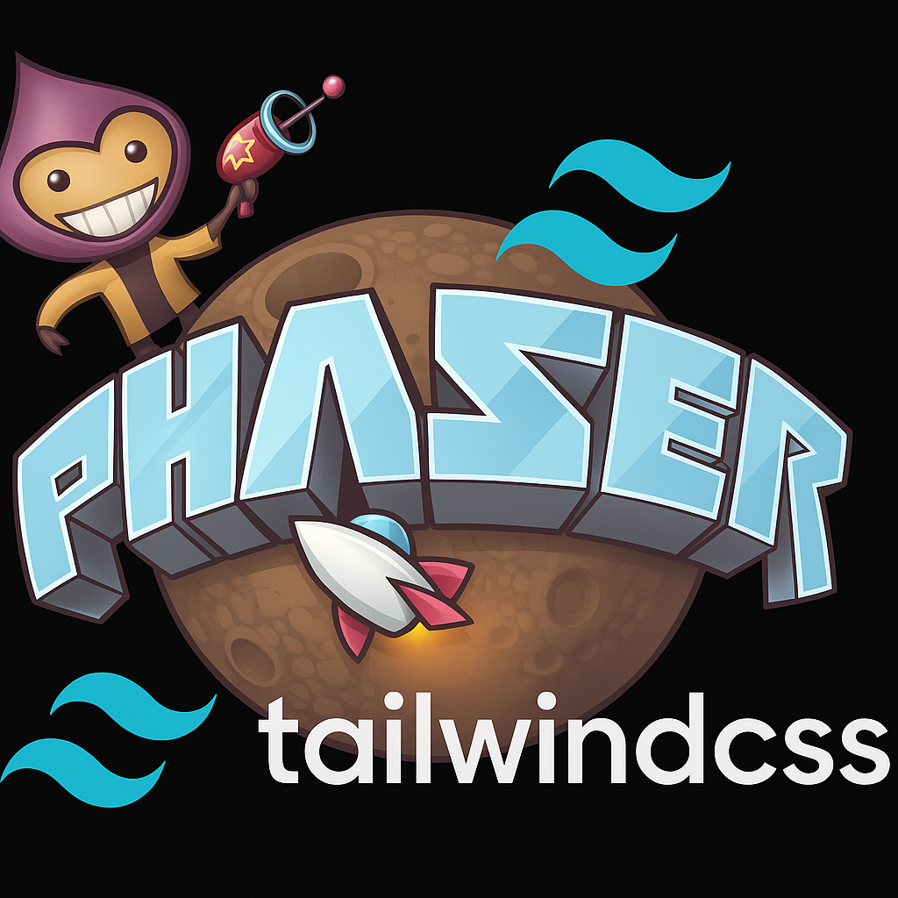

# 🌪️ Phaser Wind

<center>

</center>

> **Tired of fighting with Phaser layouts and colors?**
>
> **Love Tailwind CSS but stuck with Phaser?**
>
> **Welcome to Phaser Wind** - bring the joy and simplicity of Tailwind-like design tokens to Phaser games! 🎮✨

[](https://www.npmjs.com/package/phaser-wind)
[](https://opensource.org/licenses/MIT)
[](https://www.typescriptlang.org/)

---

## 🎯 Why Phaser Wind?

### The Problem 😫

```typescript
// Ugh... more magic numbers and random colors
const button = this.add.text(100, 50, 'Click me!', {
  fontSize: '18px', // Is this too big? Too small? 🤷‍♂️
  fill: '#3B82F6', // What color is this again?
  backgroundColor: '#1F2937', // Does this even look good?
});

const title = this.add.text(200, 100, 'Game Title', {
  fontSize: '32px', // Different magic number...
  fill: '#EF4444', // Another random hex...
});
```

### The Solution 🌟

```typescript
// No theme needed. Just import and go!
import { Color, FontSize } from 'phaser-wind';

// Clean, semantic, consistent!
const button = this.add.text(100, 50, 'Click me!', {
  fontSize: FontSize.css('lg'), // Clear intention!
  fill: Color.rgb('blue-500'), // Beautiful blue
  backgroundColor: Color.rgb('gray-800'), // Perfect contrast
});

const title = this.add.text(200, 100, 'Game Title', {
  fontSize: FontSize.css('3xl'), // Clearly bigger!
  fill: Color.rgb('red-500'), // Vibrant red
});
```

---

## 🚀 Features

- 🎨 **Complete Tailwind-like Color Palette** - 22 families × 11 shades
- 📐 **Semantic Font Sizes** - From `xs` to `6xl`
- 🧩 **Default constants ready-to-use** - `Color`, `FontSize`, `Spacing`, `Radius`, `Shadow`
- 🧭 **Optional theme system (typed)** - Add your own tokens with strong typing
- 🔧 **TypeScript First** - Full type safety and IntelliSense
- 🎮 **Phaser Ready** - Global plugin for easy access in scenes
- 🌈 **Consistent Design** - No more guessing colors and sizes
- 📦 **Tiny Bundle** - Great DX, minimal overhead

---

## 📦 Installation

```bash
npm install phaser-wind
# or
yarn add phaser-wind
# or
pnpm add phaser-wind
```

---

## 🎨 Color System (no theme)

### Complete Palette

Access all Tailwind colors with semantic naming:

```typescript
import { Color } from 'phaser-wind';

// RGB strings (for Phaser text styles)
const blueText = Color.rgb('blue-500'); // 'rgb(59, 130, 246)'
const redButton = Color.rgb('red-600'); // 'rgb(220, 38, 38)'

// Hex numbers (for Phaser graphics)
const greenRect = Color.hex('green-400'); // 0x4ADE80
const purpleCircle = Color.hex('purple-300'); // 0xD8B4FE

// Basic colors
const blackText = Color.rgb('black'); // 'rgb(0, 0, 0)'
const whiteBackground = Color.hex('white'); // 0xFFFFFF
```

### Available Colors

**Grays:** `slate`, `gray`, `zinc`, `neutral`, `stone`  
**Colors:** `red`, `orange`, `amber`, `yellow`, `lime`, `green`, `emerald`, `teal`, `cyan`, `sky`, `blue`, `indigo`, `violet`, `purple`, `fuchsia`, `pink`, `rose`  
**Shades:** `50`, `100`, `200`, `300`, `400`, `500`, `600`, `700`, `800`, `900`, `950`

---

## 📏 Font Size System (no theme)

### Semantic Sizing

Stop guessing font sizes and use semantic tokens:

```typescript
import { FontSize } from 'phaser-wind';

// Get pixel values
const smallText = FontSize.px('sm'); // 14
const normalText = FontSize.px('base'); // 16
const largeTitle = FontSize.px('3xl'); // 30

// Get CSS strings (perfect for Phaser)
const buttonText = FontSize.css('lg'); // '18px'
const heroTitle = FontSize.css('6xl'); // '60px'

// Get rem values (if needed)
const responsiveText = FontSize.rem('xl'); // 1.25
```

### Font Size Scale

| Token  | Pixels | Use Case                |
| ------ | ------ | ----------------------- |
| `xs`   | 12px   | Small labels, captions  |
| `sm`   | 14px   | Body text, descriptions |
| `base` | 16px   | Default text size       |
| `lg`   | 18px   | Slightly larger text    |
| `xl`   | 20px   | Subheadings             |
| `2xl`  | 24px   | Headings                |
| `3xl`  | 30px   | Large headings          |
| `4xl`  | 36px   | Hero text               |
| `5xl`  | 48px   | Display text            |
| `6xl`  | 60px   | Giant display text      |

---

## 🧪 Strong typing (no theme)

All APIs are strongly typed. Invalid tokens break at compile time:

```ts
import { Color, FontSize, Spacing, Radius, Shadow } from 'phaser-wind';

// ✅ OK
Color.rgb('blue-500');
FontSize.css('lg');
Spacing.px('16');
Radius.css('sm');
Shadow.get('md');

// ❌ Compile-time errors
// Color.rgb('blue-501');
// FontSize.css('huge');
// Spacing.px('97');
// Radius.css('xxl');
// Shadow.get('mega');
```

---

## 🧱 Token Reference

### Colors

- Families: `slate`, `gray`, `zinc`, `neutral`, `stone`, `red`, `orange`, `amber`, `yellow`, `lime`, `green`, `emerald`, `teal`, `cyan`, `sky`, `blue`, `indigo`, `violet`, `purple`, `fuchsia`, `pink`, `rose`
- Shades: `50`, `100`, `200`, `300`, `400`, `500`, `600`, `700`, `800`, `900`, `950`
- Special: `black`, `white`

### Font Size

- Keys: `xs`, `sm`, `base`, `lg`, `xl`, `2xl`, `3xl`, `4xl`, `5xl`, `6xl`

### Spacing

- Keys (px scale ×4): `0`, `px(=1)`, `0.5`, `1`, `1.5`, `2`, `2.5`, `3`, `3.5`, `4`, `5`, `6`, `7`, `8`, `9`, `10`, `11`, `12`, `14`, `16`, `20`, `24`, `28`, `32`, `36`, `40`, `44`, `48`, `52`, `56`, `60`, `64`, `72`, `80`, `96`

### Radius

- Keys: `none`, `sm`, `default`, `md`, `lg`, `xl`, `2xl`, `3xl`, `full`

### Shadow

- Default keys: `sm`, `md`, `lg`, `xl`, `2xl`, `inner`

---

## 🎨 Theming (optional, typed)

Phaser Wind also provides a typed theme system via a Phaser plugin. You get the same API surface (`color`, `fontSize`, `spacing`, `radius`, `font`, `shadow`) but narrowed to your custom tokens.

### 1) Create a theme

```ts
import { createTheme, type CreateTheme } from 'phaser-wind';

export const theme = createTheme({
  fonts: {
    primary: 'Inter, system-ui, sans-serif',
    display: 'Orbitron, monospace',
  },
  fontSizes: {
    // optional overrides
  },
  colors: {
    primary: 'blue-600',
    background: 'slate-900',
    danger: 'red-500',
  },
  spacing: {
    gutter: 24,
  },
  radius: {
    card: 12,
  },
  effects: {
    glow: { blur: 8, offsetX: 0, offsetY: 0, alpha: 0.6 },
  },
} satisfies CreateTheme<any>);

export type ThemeType = typeof theme;
```

### 2) Install the plugin in Phaser

```ts
import {
  PhaserWindPlugin,
  PHASER_WIND_KEY,
  defaultLightTheme,
} from 'phaser-wind';
import { theme } from './theme';

new Phaser.Game({
  plugins: {
    global: [
      {
        key: PHASER_WIND_KEY,
        plugin: PhaserWindPlugin,
        mapping: PHASER_WIND_KEY, // scene.pw
        data: { theme }, // or { theme: defaultLightTheme }
      },
    ],
  },
});
```

### 3) (Optional) Module augmentation for better typing in scenes

```ts
// types/phaser-wind.d.ts
import 'phaser';
import type { PhaserWindPlugin } from 'phaser-wind';
import type { ThemeType } from './theme';

declare module 'phaser' {
  interface Scene {
    pw: PhaserWindPlugin<ThemeType>;
  }
}
```

### 4) Typed usage in scenes

```ts
export class GameScene extends Phaser.Scene {
  create() {
    const { color, fontSize, spacing, radius, font, shadow } = this.pw;

    // ✅ Type-narrowed to your theme
    color.rgb('primary');
    fontSize.css('lg');
    spacing.px('gutter');
    radius.css('card');
    font.family('display');
    shadow.get('glow');

    // ❌ Compile-time errors
    // color.rgb('blue-501');
    // spacing.px('unknown');
  }
}
```

> Note: The old `ThemeManager` API is deprecated and has been removed from the docs.

### 🎮 **Real Game Example**

```typescript
export class GameScene extends Phaser.Scene {
  create() {
    // Player health bar with theme colors
    const healthWidth = Spacing.px('24'); // 96px
    const healthHeight = Spacing.px('4'); // 16px

    this.add.rectangle(
      50,
      50,
      healthWidth,
      healthHeight,
      Color.hex('player-health')
    ); // Green from theme

    // Game title with theme typography
    this.add
      .text(400, 50, 'CYBER QUEST', {
        fontSize: FontSize.css('4xl'),
        fontFamily: Font.family('display'),
        color: Color.rgb('primary'), // Purple from theme
      })
      .setOrigin(0.5);

    // UI button with consistent spacing and colors
    this.createButton(
      400,
      400,
      'START GAME',
      Spacing.px('16'), // 64px width
      Spacing.px('6') // 24px height
    );
  }

  createButton(
    x: number,
    y: number,
    text: string,
    width: number,
    height: number
  ) {
    const button = this.add
      .rectangle(x, y, width, height, Color.hex('ui-background'))
      .setInteractive()
      .on('pointerover', () => button.setFillStyle(Color.hex('secondary')))
      .on('pointerout', () => button.setFillStyle(Color.hex('ui-background')));

    this.add
      .text(x, y, text, {
        fontSize: FontSize.css('base'),
        fontFamily: Font.family('primary'),
        color: Color.rgb('primary'),
      })
      .setOrigin(0.5);
  }
}
```

### 🎨 **Pre-built Themes**

```typescript
import { defaultLightTheme, defaultDarkTheme } from 'phaser-wind';

// Light theme with professional colors
ThemeManager.init(defaultLightTheme);

// Dark theme perfect for games
ThemeManager.init(defaultDarkTheme);

// Create variations
const winterTheme = ThemeManager.extendCurrentTheme({
  'colors.primary': 'blue-400',
  'colors.secondary': 'cyan-300',
  'colors.accent': 'white',
});
```

### 🔗 **Smart Token References**

Themes can reference other tokens using dot notation:

```typescript
const theme = createTheme({
  colors: {
    brand: 'purple-600',
    danger: 'red-500',
  },
  typography: {
    title: {
      fontSize: '4xl',
      fontFamily: 'fonts.display', // 🔗 Auto-resolves to fonts.display
      color: 'colors.brand', // 🔗 Auto-resolves to purple-600
    },
  },
  effects: {
    'brand-glow': {
      color: 'colors.brand', // 🔗 Auto-resolves to purple-600
      blur: 8,
    },
  },
});
```

---

## 💡 Real-World Examples

### Game UI Components

```typescript
import { Color, FontSize } from 'phaser-wind';

export class GameScene extends Phaser.Scene {
  create() {
    // Main title
    this.add
      .text(400, 100, 'SPACE RAIDERS', {
        fontSize: FontSize.css('5xl'),
        fill: Color.rgb('yellow-400'),
        stroke: Color.rgb('yellow-800'),
        strokeThickness: 2,
      })
      .setOrigin(0.5);

    // Score display
    this.add.text(50, 50, 'Score: 12,500', {
      fontSize: FontSize.css('xl'),
      fill: Color.rgb('green-400'),
    });

    // Health bar background
    const healthBg = this.add.graphics();
    healthBg.fillStyle(Color.hex('red-900'));
    healthBg.fillRect(50, 100, 200, 20);

    // Health bar fill
    const healthFill = this.add.graphics();
    healthFill.fillStyle(Color.hex('red-500'));
    healthFill.fillRect(52, 102, 156, 16); // 80% health

    // Game over screen
    this.add.rectangle(400, 300, 600, 400, Color.hex('slate-900'), 0.9);

    this.add
      .text(400, 250, 'GAME OVER', {
        fontSize: FontSize.css('4xl'),
        fill: Color.rgb('red-500'),
      })
      .setOrigin(0.5);

    this.add
      .text(400, 320, 'Final Score: 12,500', {
        fontSize: FontSize.css('2xl'),
        fill: Color.rgb('slate-300'),
      })
      .setOrigin(0.5);
  }
}
```

### Button System

```typescript
class GameButton {
  constructor(
    scene: Phaser.Scene,
    x: number,
    y: number,
    text: string,
    variant: 'primary' | 'secondary' | 'danger' = 'primary'
  ) {
    const colors = {
      primary: {
        bg: Color.hex('blue-600'),
        bgHover: Color.hex('blue-700'),
        text: Color.rgb('white'),
      },
      secondary: {
        bg: Color.hex('slate-600'),
        bgHover: Color.hex('slate-700'),
        text: Color.rgb('slate-100'),
      },
      danger: {
        bg: Color.hex('red-600'),
        bgHover: Color.hex('red-700'),
        text: Color.rgb('white'),
      },
    };

    const style = colors[variant];

    // Background
    this.background = scene.add
      .rectangle(x, y, 200, 50, style.bg)
      .setInteractive()
      .on('pointerover', () => this.background.setFillStyle(style.bgHover))
      .on('pointerout', () => this.background.setFillStyle(style.bg));

    // Text
    this.text = scene.add
      .text(x, y, text, {
        fontSize: FontSize.css('lg'),
        fill: style.text,
      })
      .setOrigin(0.5);
  }
}

// Usage
const playButton = new GameButton(this, 400, 200, 'PLAY', 'primary');
const settingsButton = new GameButton(this, 400, 280, 'SETTINGS', 'secondary');
const quitButton = new GameButton(this, 400, 360, 'QUIT', 'danger');
```

### Particle Effects with Color Harmony

```typescript
// Create harmonious particle effects
this.add.particles(player.x, player.y, 'sparkle', {
  speed: { min: 50, max: 100 },
  tint: [
    Color.hex('blue-400'),
    Color.hex('blue-500'),
    Color.hex('blue-600'),
    Color.hex('cyan-400'),
    Color.hex('cyan-500'),
  ],
  lifespan: 1000,
});
```

---

## 🎮 Integration with Phaser (no theme)

### Scene Setup

```typescript
import { Color, FontSize } from 'phaser-wind';

export class MenuScene extends Phaser.Scene {
  constructor() {
    super({ key: 'MenuScene' });
  }

  create() {
    // Background gradient effect
    const bg = this.add.graphics();
    bg.fillGradientStyle(
      Color.hex('slate-900'), // top-left
      Color.hex('slate-800'), // top-right
      Color.hex('slate-800'), // bottom-left
      Color.hex('slate-700') // bottom-right
    );
    bg.fillRect(0, 0, this.cameras.main.width, this.cameras.main.height);

    // Consistent UI elements
    this.createTitle();
    this.createMenu();
  }

  private createTitle() {
    this.add
      .text(this.cameras.main.centerX, 150, 'MY AWESOME GAME', {
        fontSize: FontSize.css('4xl'),
        fill: Color.rgb('yellow-400'),
        stroke: Color.rgb('yellow-700'),
        strokeThickness: 3,
      })
      .setOrigin(0.5);
  }

  private createMenu() {
    const menuItems = ['Play', 'Options', 'Credits', 'Quit'];

    menuItems.forEach((item, index) => {
      this.add
        .text(this.cameras.main.centerX, 250 + index * 60, item, {
          fontSize: FontSize.css('xl'),
          fill: Color.rgb('slate-300'),
        })
        .setOrigin(0.5)
        .setInteractive()
        .on('pointerover', function () {
          this.setTint(Color.hex('yellow-400'));
        })
        .on('pointerout', function () {
          this.clearTint();
        });
    });
  }
}
```

---

## 🔧 Advanced Usage

### Custom Color Schemes

```typescript
// Create consistent themes
const darkTheme = {
  background: Color.hex('slate-900'),
  surface: Color.hex('slate-800'),
  primary: Color.hex('blue-500'),
  secondary: Color.hex('slate-600'),
  text: Color.rgb('slate-100'),
  textMuted: Color.rgb('slate-400'),
};

const lightTheme = {
  background: Color.hex('slate-50'),
  surface: Color.hex('white'),
  primary: Color.hex('blue-600'),
  secondary: Color.hex('slate-200'),
  text: Color.rgb('slate-900'),
  textMuted: Color.rgb('slate-600'),
};
```

### Responsive Text Sizing

```typescript
// Scale text based on screen size
const getResponsiveTextSize = (baseSize: FontSizeKey): string => {
  const scale = this.cameras.main.width / 1920; // Base on 1920px width
  const basePixels = FontSize.px(baseSize);
  return `${Math.round(basePixels * scale)}px`;
};

this.add.text(x, y, 'Responsive Text', {
  fontSize: getResponsiveTextSize('2xl'),
  fill: Color.rgb('blue-500'),
});
```

---

## 🤝 Why "Wind" instead of "Tailwind"?

We love Tailwind CSS, but we're not affiliated with them. "Phaser Wind" captures the essence:

- **Wind** = Fast, natural, refreshing (like your development experience)
- **Wind** = Carries things forward (like your game development)
- **Wind** = Invisible but powerful (like good design tokens)

Plus, `phaser-wind` is way easier to type than `phaser-tailwind-css-design-tokens-for-games` 😉

---

## 📚 Compared to Raw Phaser

| Without Phaser Wind      | With Phaser Wind                |
| ------------------------ | ------------------------------- |
| `fill: '#3B82F6'`        | `fill: Color.rgb('primary')`    |
| `fontSize: '18px'`       | `fontSize: FontSize.css('lg')`  |
| `tint: 0x4ADE80`         | `tint: Color.hex('success')`    |
| `fontFamily: 'Arial'`    | `fontFamily: Font.family('ui')` |
| Magic numbers everywhere | Semantic, consistent tokens     |
| Color picking hell       | Harmonious color palettes       |
| Inconsistent sizing      | Perfect typography scale        |
| No design system         | Complete theme architecture     |

---

## 🔮 Coming Soon

- 📐 **Layout Utilities** - Flexbox-inspired alignment helpers
- 📱 **Responsive Utilities** - Breakpoint-based design tokens
- ⚡ **Animation Presets** - Smooth, consistent transitions
- 🎮 **Component Library** - Pre-built Phaser components with theme support
- 🔧 **CLI Tool** - Generate themes and components from the command line

---

## 🤝 Contributing

We'd love your help making Phaser Wind even better!

1. Fork the repository
2. Create your feature branch (`git checkout -b feature/amazing-feature`)
3. Commit your changes (`git commit -m 'Add amazing feature'`)
4. Push to the branch (`git push origin feature/amazing-feature`)
5. Open a Pull Request

---

## 📄 License

MIT © [CassinoDev](https://github.com/cassinodev)

---

## 🌟 Show Your Support

If Phaser Wind makes your game development life better, give us a ⭐ on GitHub!

**Happy Gaming!** 🎮✨

---

> _"Making Phaser development as enjoyable as Tailwind CSS"_
>
> — The Phaser Wind Team
