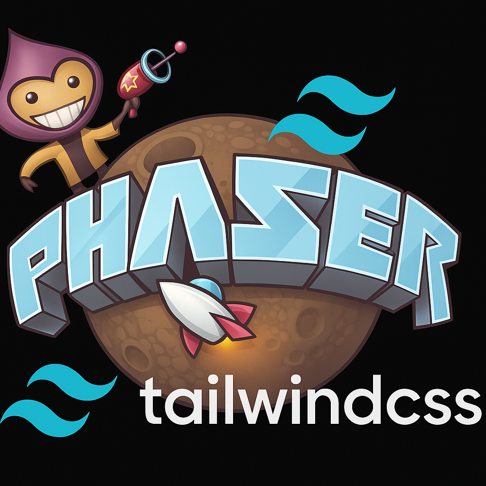

# 🌪️ Phaser Wind

<p align="center">
    
</p>

> **Tired of fighting with Phaser layouts and colors?**
>
> **Love Tailwind CSS but stuck with Phaser?**
>
> **Welcome to Phaser Wind** - bring the joy and simplicity of Tailwind-like design tokens to Phaser games! 🎮✨

[](https://www.npmjs.com/package/phaser-wind)
[](https://opensource.org/licenses/MIT)
[](https://www.typescriptlang.org/)

---

## 🎯 Why Phaser Wind?

### The Problem 😫

```typescript
// Ugh... more magic numbers and random colors
const button = this.add.text(100, 50, 'Click me!', {
  fontSize: '18px', // Is this too big? Too small? 🤷‍♂️
  fill: '#3B82F6', // What color is this again?
  backgroundColor: '#1F2937', // Does this even look good?
});

const title = this.add.text(200, 100, 'Game Title', {
  fontSize: '32px', // Different magic number...
  fill: '#EF4444', // Another random hex...
});
```

### The Solution 🌟

```typescript
// No theme needed. Just import and go!
import { Color, FontSize } from 'phaser-wind';

// Clean, semantic, consistent!
const button = this.add.text(100, 50, 'Click me!', {
  fontSize: FontSize.css('lg'), // Clear intention!
  fill: Color.rgb('blue-500'), // Beautiful blue
  backgroundColor: Color.rgb('gray-800'), // Perfect contrast
});

const title = this.add.text(200, 100, 'Game Title', {
  fontSize: FontSize.css('3xl'), // Clearly bigger!
  fill: Color.rgb('red-500'), // Vibrant red
});
```

---

## 🚀 Features

- 🎨 **Complete Tailwind-like Color Palette** - 22 families × 11 shades
- 📐 **Semantic Font Sizes** - From `xs` to `6xl`
- 🧩 **Default constants ready-to-use** - `Color`, `FontSize`, `Spacing`, `Radius`, `Shadow`
- 🧭 **Optional theme system (typed)** - Add your own tokens with strong typing
- 🔧 **TypeScript First** - Full type safety and IntelliSense
- 🎮 **Phaser Ready** - Global plugin for easy access in scenes
- 🌈 **Consistent Design** - No more guessing colors and sizes
- 📦 **Tiny Bundle** - Great DX, minimal overhead

---

## 📦 Installation

```bash
npm install phaser-wind
# or
yarn add phaser-wind
# or
pnpm add phaser-wind
```

## 🌐 UMD/CDN (JavaScript)

If you prefer not to use TypeScript or want to include the library via CDN, you can use the UMD build:

```html
<script src="https://cdn.jsdelivr.net/npm/phaser-wind@0.7.0/dist/phaser-wind.min.js"></script>
```

The library will be available globally as `window.PhaserWind`. You can use it like this:

```javascript
// Use color utilities
const blueColor = window.PhaserWind.Color.rgb('blue-500');
const fontSize = window.PhaserWind.FontSize.css('lg');

// Create styled text
const text = scene.add.text(100, 50, 'Hello World', {
  fontSize: fontSize,
  fill: blueColor
});
```

> **⚠️ Note**: While UMD builds are available, we **strongly recommend using TypeScript** for better type safety, IntelliSense, and development experience. The TypeScript version provides better error detection and autocomplete features.

---

## 🎨 Color System (no theme)

### Complete Palette

Access all Tailwind colors with semantic naming:

```typescript
import { Color } from 'phaser-wind';

// RGB strings (for Phaser text styles)
const blueText = Color.rgb('blue-500'); // 'rgb(59, 130, 246)'
const redButton = Color.rgb('red-600'); // 'rgb(220, 38, 38)'

// Hex numbers (for Phaser graphics)
const greenRect = Color.hex('green-400'); // 0x4ADE80
const purpleCircle = Color.hex('purple-300'); // 0xD8B4FE

// Basic colors
const blackText = Color.rgb('black'); // 'rgb(0, 0, 0)'
const whiteBackground = Color.hex('white'); // 0xFFFFFF
```

### Available Colors

**Grays:** `slate`, `gray`, `zinc`, `neutral`, `stone`  
**Colors:** `red`, `orange`, `amber`, `yellow`, `lime`, `green`, `emerald`, `teal`, `cyan`, `sky`, `blue`, `indigo`, `violet`, `purple`, `fuchsia`, `pink`, `rose`  
**Shades:** `50`, `100`, `200`, `300`, `400`, `500`, `600`, `700`, `800`, `900`, `950`

---

## 📏 Font Size System (no theme)

### Semantic Sizing

Stop guessing font sizes and use semantic tokens:

```typescript
import { FontSize } from 'phaser-wind';

// Get pixel values
const smallText = FontSize.px('sm'); // 14
const normalText = FontSize.px('base'); // 16
const largeTitle = FontSize.px('3xl'); // 30

// Get CSS strings (perfect for Phaser)
const buttonText = FontSize.css('lg'); // '18px'
const heroTitle = FontSize.css('6xl'); // '60px'

// Get rem values (if needed)
const responsiveText = FontSize.rem('xl'); // 1.25
```

### Font Size Scale

| Token  | Pixels | Use Case                |
| ------ | ------ | ----------------------- |
| `xs`   | 12px   | Small labels, captions  |
| `sm`   | 14px   | Body text, descriptions |
| `base` | 16px   | Default text size       |
| `lg`   | 18px   | Slightly larger text    |
| `xl`   | 20px   | Subheadings             |
| `2xl`  | 24px   | Headings                |
| `3xl`  | 30px   | Large headings          |
| `4xl`  | 36px   | Hero text               |
| `5xl`  | 48px   | Display text            |
| `6xl`  | 60px   | Giant display text      |

---

## 🧪 Strong typing (no theme)

All APIs are strongly typed. Invalid tokens break at compile time:

```ts
import { Color, FontSize, Spacing, Radius, Shadow } from 'phaser-wind';

// ✅ OK
Color.rgb('blue-500');
FontSize.css('lg');
Spacing.px('16');
Radius.css('sm');
Shadow.get('md');

// ❌ Compile-time errors
// Color.rgb('blue-501');
// FontSize.css('huge');
// Spacing.px('97');
// Radius.css('xxl');
// Shadow.get('mega');
```

---

## 🧱 Token Reference

### Colors

- Families: `slate`, `gray`, `zinc`, `neutral`, `stone`, `red`, `orange`, `amber`, `yellow`, `lime`, `green`, `emerald`, `teal`, `cyan`, `sky`, `blue`, `indigo`, `violet`, `purple`, `fuchsia`, `pink`, `rose`
- Shades: `50`, `100`, `200`, `300`, `400`, `500`, `600`, `700`, `800`, `900`, `950`
- Special: `black`, `white`

### Font Size

- Keys: `xs`, `sm`, `base`, `lg`, `xl`, `2xl`, `3xl`, `4xl`, `5xl`, `6xl`

### Spacing

- Keys (px scale ×4): `0`, `px(=1)`, `0.5`, `1`, `1.5`, `2`, `2.5`, `3`, `3.5`, `4`, `5`, `6`, `7`, `8`, `9`, `10`, `11`, `12`, `14`, `16`, `20`, `24`, `28`, `32`, `36`, `40`, `44`, `48`, `52`, `56`, `60`, `64`, `72`, `80`, `96`

### Radius

- Keys: `none`, `sm`, `default`, `md`, `lg`, `xl`, `2xl`, `3xl`, `full`

### Shadow

- Default keys: `sm`, `md`, `lg`, `xl`, `2xl`, `inner`

---

## 🎨 Theming

Phaser Wind also provides a typed theme system via a Phaser plugin. You get the same API surface (`color`, `fontSize`, `spacing`, `radius`, `font`, `shadow`) but narrowed to your custom tokens.

### 1) Create a theme

```ts
import { createTheme, type CreateTheme } from 'phaser-wind';

export const theme = createTheme({
  fonts: {
    primary: 'Inter, system-ui, sans-serif',
    display: 'Orbitron, monospace',
  },
  fontSizes: {
    // optional overrides
  },
  colors: {
    primary: 'blue-600',
    background: 'slate-900',
    danger: 'red-500',
  },
  spacing: {
    gutter: 24,
  },
  radius: {
    card: 12,
  },
  effects: {
    glow: { blur: 8, offsetX: 0, offsetY: 0, alpha: 0.6 },
  },
} satisfies CreateTheme<any>);

export type ThemeType = typeof theme;
```

### 2) Install the plugin in Phaser

```ts
import {
  PhaserWindPlugin,
  PHASER_WIND_KEY,
  defaultLightTheme,
} from 'phaser-wind';
import { theme } from './theme';

new Phaser.Game({
  plugins: {
    global: [
      {
        key: PHASER_WIND_KEY,
        plugin: PhaserWindPlugin,
        mapping: PHASER_WIND_KEY, // scene.pw
        data: { theme }, // or { theme: defaultLightTheme }
      },
    ],
  },
});
```

### 3) Access the plugin from your scene with `withPhaserWind`

Use the `withPhaserWind(scene)` accessor to get a fully typed handle to the plugin. It composes with any base scene, doesn't rely on global module augmentation, and infers your theme's tokens at the call site.

```ts
import Phaser from 'phaser';
import { withPhaserWind } from 'phaser-wind';
import type { ThemeType } from './theme'; // your createTheme() result

class MyScene extends Phaser.Scene {
  create(): void {
    const pw = withPhaserWind<ThemeType>(this);
    const { color, fontSize, spacing, radius, font, shadow } = pw;

    this.cameras.main.setBackgroundColor(color.rgb('background'));

    this.add
      .text(300, 100, 'Primary color', {
        fontSize: fontSize.css('2xl'),
        color: color.rgb('primary'), // ✅ Type-narrowed to your theme
      })
      .setOrigin(0.5);

    // ✅ Type-narrowed to your theme
    spacing.px('gutter');
    radius.css('card');
    font.family('display');
    shadow.get('glow');

    // ❌ Compile-time errors
    // color.rgb('blue-501');
    // spacing.px('unknown');
  }
}
```

Call `withPhaserWind(this)` inside `create()` / `update()` (after the plugin has mounted). Don't call it in the constructor or `init()` — the plugin isn't attached yet.

### 4) Recommended: wrap it in a project-local helper

Passing `<ThemeType>` on every call gets old. Define a one-line helper once in your project so scenes stay short and the theme type stays in one place:

```ts
// src/theme.ts (in your project)
import type { Scene } from 'phaser';
import { createTheme, withPhaserWind, type CreateTheme } from 'phaser-wind';

export const theme = createTheme({
  colors: { primary: 'blue-600', danger: 'red-500' },
  // ...
} satisfies CreateTheme<any>);

export type ThemeType = typeof theme;

/** Project-local accessor — no need to pass the theme type. */
export const withPw = (scene: Scene) => withPhaserWind<ThemeType>(scene);
```

Now every scene is a one-liner:

```ts
import Phaser from 'phaser';
import { withPw } from './theme';

class MyScene extends Phaser.Scene {
  create(): void {
    const pw = withPw(this); // fully typed against your theme
    this.cameras.main.setBackgroundColor(pw.color.rgb('background'));
  }
}
```

You can name the helper whatever fits your style — `withPw`, `usePw`, `getPw`, `pw`. The lib intentionally doesn't ship an alias, so you own the naming in your codebase.

### 🎮 **Real Game Example**

You can check some examples in our [Storybook in this clicking here](https://renatocassino.github.io/phaser-toolkit).

### 🎨 **Pre-built Themes**

```ts
import {
  PhaserWindPlugin,
  PHASER_WIND_KEY,
  defaultLightTheme,
  // or defaultDarkTheme
} from 'phaser-wind';
import { theme } from './theme';

new Phaser.Game({
  plugins: {
    global: [
      {
        key: PHASER_WIND_KEY,
        plugin: PhaserWindPlugin,
        mapping: PHASER_WIND_KEY, // scene.pw
        data: { theme: defaultLighTheme }, // or { theme: defaultDarkTheme }
      },
    ],
  },
});
```

## 🤝 Why "Wind" instead of "Tailwind"?

We love Tailwind CSS, but we're not affiliated with them. "Phaser Wind" captures the essence:

- **Wind** = Fast, natural, refreshing (like your development experience)
- **Wind** = Carries things forward (like your game development)
- **Wind** = Invisible but powerful (like good design tokens)

Plus, `phaser-wind` is way easier to type than `phaser-tailwind-css-design-tokens-for-games` 😉

---

## 📚 Compared to Raw Phaser

| Without Phaser Wind      | With Phaser Wind                |
| ------------------------ | ------------------------------- |
| `fill: '#3B82F6'`        | `fill: Color.rgb('primary')`    |
| `fontSize: '18px'`       | `fontSize: FontSize.css('lg')`  |
| `tint: 0x4ADE80`         | `tint: Color.hex('success')`    |
| `fontFamily: 'Arial'`    | `fontFamily: Font.family('ui')` |
| Magic numbers everywhere | Semantic, consistent tokens     |
| Color picking hell       | Harmonious color palettes       |
| Inconsistent sizing      | Perfect typography scale        |
| No design system         | Complete theme architecture     |

---

## 🤝 Contributing

We'd love your help making Phaser Wind even better!

1. Fork the repository
2. Create your feature branch (`git checkout -b feature/amazing-feature`)
3. Commit your changes (`git commit -m 'Add amazing feature'`)
4. Push to the branch (`git push origin feature/amazing-feature`)
5. Open a Pull Request

---

## 📄 License

MIT © [CassinoDev](https://github.com/cassinodev)

Do you want to play? Go to [games.cassino.dev](https://games.cassino.dev).

---

## 🌟 Show Your Support

If Phaser Wind makes your game development life better, give us a ⭐ on GitHub!

**Happy Gaming!** 🎮✨

---

> _"Making Phaser development as enjoyable as Tailwind CSS"_
>
> — The Phaser Wind Team
